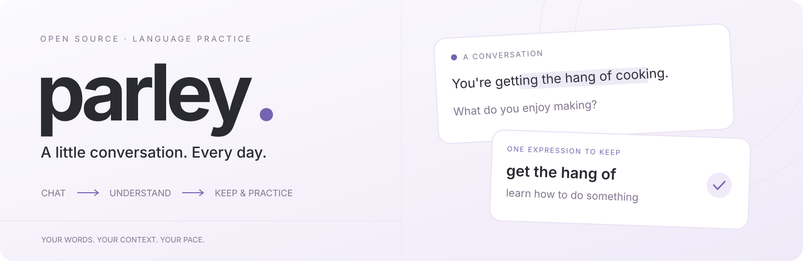

<picture>
  <source media="(prefers-color-scheme: dark)" srcset="docs/media/readme-hero-dark.svg" />
  <source media="(prefers-color-scheme: light)" srcset="docs/media/readme-hero-light.svg" />
  
</picture>

<div align="center">

# 边聊，边懂，边记住。

[在线使用](https://krahsu.github.io/parley/) · [桌面安装](docs/INSTALL.md) · [开发文档](docs/DEVELOPMENT.md)

[](LICENSE) [](https://github.com/KraHsu/parley/actions/workflows/ci.yml)

</div>

Parley 是一个用 AI 练外语的聊天工具。

一边用目标语言聊天，一边在旁边问词义、语法，或者问“这句话怎么说”。选中聊天里的词句后，助手会带着这段内容回答，不用再复制一遍。想记的表达可以连同原句存进词句本，加上释义、注释和标签，之后再复习。

也可以继续用自己的 Codex 或 Claude Code 终端，让 Parley 的小窗口在旁边答疑。

## 使用

| 方式            | 模型连接                               | 入口                                         |
| --------------- | -------------------------------------- | -------------------------------------------- |
| Web             | 自己的 API                             | [在线使用](https://krahsu.github.io/parley/) |
| 桌面            | API、本机 Codex、Claude Code           | [安装说明](docs/INSTALL.md)                  |
| 终端 + 语法窗口 | 原生 Codex / Claude Code，助手另行配置 | [终端指南](docs/TERMINAL_COMPANION.md)       |

Web 版在设置里添加 API 服务，再给主聊和语言助手选好模型、设置母语和目标语言，就可以开始聊天。两个面板可以用不同的模型。API Key 只保留在当前标签页内存，刷新后需要重新填写；服务也需要允许浏览器跨域访问（CORS）。具体步骤见 [Web 使用说明](docs/WEB.md)。

桌面端可选择 API 或本机 CLI。Claude Code 在 GUI 中需要独立 API Key，原生终端则使用 CLI 自己的登录。各类 API 和 CLI 的配置见[模型服务设置](docs/BACKENDS.md)。软件免费开源，模型请求使用你自己的账号和额度。

安装后，从终端运行：

```bash
parley-cli
```

终端里的登录、快捷键和历史照常使用。Parley 会把已保存的回复同步到语法窗口，在窗口正文里就能选词提问。恢复旧会话或同时开了多个终端时，需要在下拉框里选一下会话。[详细用法](docs/TERMINAL_COMPANION.md)

## 当前进度

目前是 **0.4.0-alpha.1** 预览版。Web 已上线；桌面端验证过 Ubuntu 24.04 amd64，Windows 和 macOS 目前只通过了构建检查，还没完成实际安装和运行测试。API 适配已实现，真实厂商测试还没做，范围见[兼容记录](docs/BACKEND_COMPATIBILITY.md)。

Linux 安装前请看[安装说明](docs/INSTALL.md)：旧的 `Parley_0.3.0_amd64.deb` 与 KDE Parley 包名冲突，修复包使用 `parley-desktop` 包名。

聊天记录和词句保存在当前浏览器或本机，模型请求会发给你配置的服务。Web 与桌面的备份暂不互通，也没有跨设备同步。[Web 数据与备份](docs/WEB.md#浏览器与数据边界) · [桌面数据与备份](docs/PERSISTENCE.md)

## 开发

Vue 3 + TypeScript，桌面端用 Tauri 2 / Rust，数据库用 Diesel / SQLite。

需要 Node.js 24.12+（24.x）。桌面开发还需要 Rust 和 [Tauri 系统依赖](https://v2.tauri.app/start/prerequisites/)。

```bash
nvm use
npm ci
npm run web:dev
```

桌面开发用 `npm run desktop:dev`。`npm run dev` 只是桌面界面的浏览器预览，连接 API 的 Web 版用 `npm run web:dev`。其余命令见[开发文档](docs/DEVELOPMENT.md)。

[架构](docs/ARCHITECTURE.md) · [词句与复习](docs/VOCABULARY.md) · [开发计划](docs/MULTI_BACKEND_PLAN.md) · [宣传脚本](docs/marketing/README.md)

遇到问题可以提 [Issue](https://github.com/KraHsu/parley/issues)，写明系统、操作步骤和报错即可。也欢迎直接提 PR。

[MIT](LICENSE)。本项目与 KDE Parley 无关，也不是模型服务商的官方客户端。
