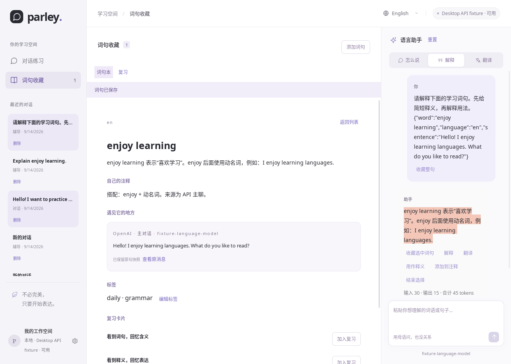
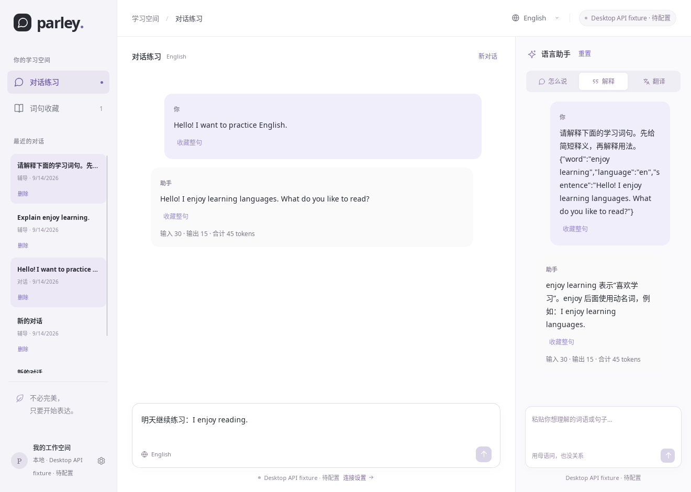
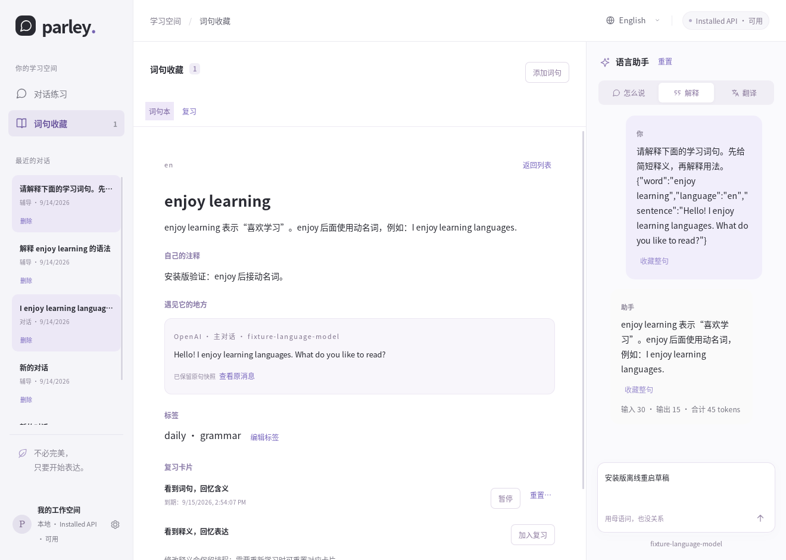

# 多模型后端实现记录

状态：开发中，尚未达到 v0.4.0 发布条件。验收范围仍以 [多模型后端开发计划](MULTI_BACKEND_PLAN.md) 为准，下面仅记录已经落地的增量，不缩减原计划。

## 2026-09-14：配置迁移与连接隔离

### 已落地

- Rust 新增严格类型的厂商、协议和公开配置，支持创建多个配置、停用、乐观版本校验及不可变历史版本。API 地址拒绝嵌入认证信息和非回环明文 HTTP；凭据字段不属于公开配置 DTO。
- 数据库迁移 004 建立 `backend_profiles`、`backend_profile_versions`、`conversation_backends`。旧偏好迁移为 `codex-default`，保留原路径、thread、账号、signature 和消息 ID。升级已有数据库前使用 SQLite `VACUUM INTO` 创建独立备份。
- Codex 连接和断开只中断该后端的记录；发送检查会话后端归属以及连接时的配置版本。配置变更后要求重新连接，不能继续向过时的连接提交请求。
- 前端将账号、模型发现、登录和连接代次迁到 `features/codex/connection.ts`；聊天和工作区流程迁到 `features/chat/`。原 store 路径只保留兼容导出，词句、复习和对话组件已改用通用聊天入口及按面板可用性判断。
- Codex 流式消息增加本地会话标识，前端过滤其他会话的迟到事件；完成后的正文不再追加迟到 delta。断开事件只更改属于 Codex 的面板。

此时 UI 仍只提供 Codex 推理。新增配置命令和类型不是 API 已可用的证据；Rust 运行时仍需完成按配置管理连接、通用 turn 与协议事件的抽离，工作区也尚未完全拆成独立 store。

### 验证与兼容证据

- 本机 CLI 版本：Codex `0.154.0`；Claude Code `2.1.269`。CLI 由用户安装，本次没有替换它们。
- Codex App Server 真实初始化、现有 ChatGPT 登录读取和模型列表读取通过；使用临时工作目录和测试数据库，没有发起模型生成。
- 自动测试新增 v3 迁移、升级前备份可读性、配置版本冲突、旧连接拒绝新配置、跨后端中断隔离、前端迟到事件过滤和其他后端面板隔离。
- 前端生产构建、仓库格式/类型检查、Rust Clippy、Linux Tauri 调试程序构建通过。前端 38 项测试、Rust 48 项普通测试通过；4 项默认忽略的测试中，另行执行的两项只读 Codex 实测通过。真实 API、Claude headless、原生 Claude 终端同步及跨后端生成尚未测试。
- 当前用户已安装的 Parley、正式学习数据库及本机 WebKit 启动配置未改动。本批未发布安装包。

### 仍需推进

| 阶段 | 当前状态 | 下一项实际交付                                                   |
| ---- | -------- | ---------------------------------------------------------------- |
| P0   | 部分完成 | 固定原生 API 流式契约，验证 Claude headless 有效限制和局部 hooks |
| P1   | 进行中   | 后端管理器、通用 turn/事件与消息投影、工作区拆分、独立连接状态   |
| P2   | 未完成   | 系统凭据库、HTTP/SSE、三种原生 API 与可操作设置界面              |
| P3   | 未开始   | 四个兼容厂商预设、参数适配与逐厂商验证                           |
| P4   | 未开始   | Claude Code GUI 的 API 认证、流式、续聊和进程回收                |
| P5   | 未开始   | 双 CLI 启动器及 Claude 终端新轮次自动同步                        |
| P6   | 未开始   | 跨后端词句来源、备份 v2、最终设置与学习闭环                      |
| P7   | 未开始   | 各服务真实调用、桌面端到端流程、安装包和用户文档                 |

迁移 004 当前只包含已经使用的配置及会话归属表。后续 turn、凭据引用、协议内容块和终端来源结构继续通过新迁移引入，不修改已经升级过的数据库所依赖的迁移内容；最终编号据此更新。

## 2026-09-14：Diesel 迁移与首批 API 接入

### 已落地

- 按用户选择采用 Diesel 2.3。后端配置、不可变配置版本、凭据引用、API 轮次，以及会话、消息、草稿和偏好设置的业务查询已迁到强类型 DSL；记录采用命名字段和 `Selectable` 映射。
- `storage/schema.rs` 覆盖当前全部表。测试将声明的表、列、类型、可空性和主键与执行迁移后的真实 SQLite 结构逐项比较。迁移保留现有文件格式、主键、`user_version` 和升级前备份；同时验证 v3、v4 升级。
- 迁移 005 新增凭据引用及 API 轮次表。每轮固化配置版本、凭据作用域、模型、实际发送的上下文、用户/助手消息 ID；流式投影按序更新，完成状态不可被迟到事件覆盖。失败或中断的回复留在本地，但不进入后续成功轮次的上下文。
- API Key 可放入系统凭据库，或仅存于当前进程内存。数据库只记录凭据引用和作用域；变更服务地址不能复用原地址的密钥。更换密钥后，旧会话要求新建对话，避免向另一个账号继续发送历史。删除凭据时，配置版本校验与外部删除使用同一数据库访问锁。
- 首批实现 OpenAI Responses 和 OpenAI 兼容 Chat Completions 的 HTTP/SSE 适配，具备超时、响应大小限制、UTF-8 分片重组、完成确认、部分正文保留、使用量及协议续聊内容保存。HTTP 禁止自动重定向。上下文按最近完整轮次裁剪，界面提示裁剪，不自动重发失败请求。
- 设置页支持添加/编辑 API 配置、手动填写模型、读取模型列表及主聊/语言助手分别选服务。API 与 Codex 使用独立取消路径，前端过滤不匹配的会话、请求、配置版本和事件序号。修改配置后提供新建会话入口。

### 验证

- 前端 40 项测试通过，包括 API 与 Codex 同时生成的事件隔离、迟到事件过滤及按请求取消；TypeScript 检查及前端生产构建通过。
- Rust 61 项普通测试通过，4 项默认忽略。新增测试覆盖 Diesel schema 一致性、API 事务中途失败回滚、凭据作用域隔离、同面板排他、完成幂等、重启恢复及上下文保留。现有词句、复习、备份往返和 Codex 协议回归仍通过。
- 回环 HTTP 测试验证真实请求路由、认证头、请求体和分片 SSE；提前 EOF 保留多语言正文并报告未完成。测试使用虚构密钥和临时数据库，不访问用户系统密钥，不发起付费模型请求。
- 仓库格式检查、Clippy（禁止警告）及 Linux Tauri 调试程序构建通过。真实厂商调用和系统凭据库桌面交互仍待实测；未修改已安装程序或正式学习数据。

### 当前边界及下一步

Diesel 迁移尚未全部完成：词句、复习和导入导出仍使用原有 rusqlite repository。过渡期间，两条连接共享一个访问锁，每个逻辑事务完整落在同一条连接上；所有 repository 迁完后移除过渡连接与 rusqlite。下一步先迁移这些学习数据模块，并完成阻塞数据库任务及流式更新批处理。

Anthropic Messages、Gemini Interactions、Claude Code GUI/原生终端适配、跨后端词句来源扩展、备份 v2、厂商参数验证和完整桌面验收继续按原计划推进。设置中的兼容厂商预设不是逐厂商实测通过的证据；尚未实现的协议标明开发中。本批尚不满足 v0.4.0 发布条件。

## 2026-09-14：完成 Diesel 业务存储迁移

- 词句 CRUD、来源、标签、草稿、复习卡、排程与撤销、导入预览/冲突/幂等和备份读取全部改用 Diesel DSL；记录映射集中于 `learning_rows.rs`，移除按列位置解码和拼接业务 SQL。
- 移除 `rusqlite` 及双连接兼容层。整个工作区使用一条 Diesel SQLite 连接和统一访问锁；迁移、失败回滚、PRAGMA 及升级前 `VACUUM INTO` 备份也由这条连接执行。SQLite 继续随程序打包。此轮没有新增数据迁移或更改已有迁移脚本。
- 保留来源、相同时间评分、导入映射以及会话列表的原有插入顺序，通过声明 SQLite 隐式 `rowid` 作为类型化列实现。新增测试验证相同时间评分仅撤销最后一项，多条来源经过备份往返顺序不变，以及语言/种类/释义/标签/复习状态的组合筛选。
- CLI 启动器改用 Diesel 只读 URI 查询偏好，不运行迁移、不获取工作区写入锁。词句与复习 Tauri 命令通过共享的阻塞任务入口执行，包含首次数据库初始化；备份导出使用事务获取一致快照。
- Rust 63 项普通测试、前端 40 项测试通过。四项默认忽略的测试中，单独执行的一万条词句磁盘数据库基准通过：60 次混合搜索 P95 **12.16 ms**、最大 **12.68 ms**，门槛为 300 ms。迁移及备份测试覆盖旧版本升级、失败回滚、旧线程保留和备份可读性。

- Codex `0.154.0` 的真实初始化、现有 ChatGPT 登录及模型列表只读测试通过，未发起生成。格式检查、TypeScript、Clippy（禁止警告）和 Linux Tauri 调试构建通过；本机已安装程序与正式学习数据未改动。

Diesel 业务存储迁移已完成；P1 的统一后端运行时、流式写入批处理、工作区 store 完整拆分，以及后续原生协议、Claude Code、终端同步、跨后端学习来源与发布验收仍需继续。本节点仍非完整多后端版本交付。

## 2026-09-14：Claude / Gemini 原生 API 与异步流式保存

- 设置页启用 Claude Messages 与 Gemini Interactions 配置。两者分别使用原生认证头、请求体、模型列表分页和 SSE 状态机；模型由服务端发现或用户填写，没有硬编码默认型号。
- Claude 按消息与内容块顺序组合文本、thinking / redacted_thinking、签名和累计用量；只有正常结束事件才标记完成。下一轮回放保存在本机的助手内容块。[Messages 流式契约](https://platform.claude.com/docs/en/build-with-claude/streaming)、[模型分页](https://platform.claude.com/docs/en/api/models/list)。
- Gemini 按当前 Interactions `event_type` 契约组装 `thought` 与 `model_output` steps，保存签名和摘要。请求固定 `Api-Revision: 2026-05-20`，使用 `store=false`，下一轮回放本地 steps；完成事件没有完整 steps，因此不以最后一个事件替代此前累积内容。缺失续聊状态时要求新建会话。[入门请求格式](https://ai.google.dev/gemini-api/docs/get-started)、[流式事件与本地组合](https://ai.google.dev/gemini-api/docs/streaming)、[模型分页](https://ai.google.dev/api/models)。
- 两种原生协议均拒绝不支持的工具/非文本内容，流内错误、输出限制或缺失完成确认保留部分正文并报告失败。未知元数据可以忽略，孤立 delta 与不完整内容块不能伪装为成功。协议思考内容用于续聊，界面只投影回答正文。
- API 运行时在读取数据库和凭据前登记活动请求，准备阶段也可取消。会话准备、流式保存和最终状态通过阻塞任务访问 Diesel；正文更新约每 50 ms 合并一次，完成立即保存。事件仍在数据库接受对应序号后发送，旧写入不能覆盖最终状态。
- 回环 HTTP 测试覆盖两种原生服务各两轮请求、独立认证头、分片 UTF-8、签名续聊、临时磁盘数据库持久化、模型列表分页/游标编码/去重；另验证按配置取消不影响另一个活动面板，以及连续 delta 合并后正文和完成事件不丢失。
- Rust **70 项**普通测试、前端 **40 项**测试通过；4 项默认忽略的测试本轮未重跑。格式检查、TypeScript、Clippy（禁止警告）、前端生产构建和 Linux Tauri 调试构建通过。

### 当前剩余范围

P2 的三种原生 API 已有实现及本地协议测试，真实服务调用和系统凭据库桌面交互仍未验证。模型发现不保证列出的每个模型均支持本项目的文本协议，需用户选择适用模型；兼容厂商的参数适配与逐厂商验证仍按 P3 推进。

P1 的 Codex 多配置运行时与完整工作区 store 拆分、P4/P5 的 Claude Code GUI 与原生终端伴随、P6 的用量展示/跨后端学习来源/备份 v2，以及 P7 桌面验收与发布继续待办。本节点不代表 v0.4.0 已完成。

## 2026-09-14：Claude Code GUI 后端

- 设置页启用 Claude Code 配置，用户选择自己的本机可执行文件及 API Key；主聊和语言助手使用现有通用管理器独立运行。连接检查验证 CLI 参数能力并读取 Anthropic 模型列表，不生成回答。API-only 安装继续不依赖 CLI。
- 使用官方 `--bare` / `--restricted` / `--tools ""`、空 MCP 配置、禁用技能和 hooks，以及禁止交互权限询问。每轮检查实际 `system/init` 中的工具、MCP、技能、插件、认证来源和权限模式；不符合时停止。[CLI 参数](https://code.claude.com/docs/en/cli-reference)。
- 子进程仅继承明确列出的系统、运行时和代理环境，API Key 只通过该进程的环境传入。GUI 不继承 OAuth、其他厂商密钥、路由开关、动态加载器或用户 apiKeyHelper。配置与 CLI transcript 放在数据库旁的独立目录，按配置版本、凭据作用域和本地会话分隔；Unix 目录权限为 0700。[bare 模式与认证](https://code.claude.com/docs/en/headless)、[配置目录环境变量](https://code.claude.com/docs/en/env-vars)。
- 原文通过 stdin 发送，不进入 shell 或命令行参数。每个新 turn 使用自己的 UUID；续聊使用上一次成功记录中的精确 session ID，配合 `--fork-session` 创建本轮分支。失败和中断的分支不参与下次恢复。会话标识由 Diesel 随成功结果保存，无需新增或改写数据迁移。
- JSONL 按字节增量解析，限制整体与单行大小，处理 Anthropic 内容块及 CLI 最终结果；仅有正文、缺失 result、会话不符、工具请求或非零退出都不能标记成功。正文继续约 50 ms 合并保存。stderr 保留有界尾部，只返回固定诊断分类，不显示原始凭据、厂商响应或学习文本。
- 使用 `CLAUDE_CODE_MAX_RETRIES=0`，遇到重试事件也立即停止；输出上限 4096，单次 agentic turn 上限为 1。生成超时和取消后回收本轮进程；Unix 使用独立进程组终止后代，Windows 的进程树回收分支尚未原生实测。[官方重试和输出控制](https://code.claude.com/docs/en/env-vars)。

### 验证与剩余范围

- 实际运行本机 `Claude Code 2.1.269`，请求全部发往临时回环 HTTP 服务，使用虚构密钥和临时配置目录。确认 `tools=[]`、`mcp_servers=[]`、`apiKeySource=ANTHROPIC_API_KEY`；两轮输出成功，第二轮真实请求包含第一轮回答并使用新 session 分支；503 测试及时失败，未伪装成成功。
- 新增自动测试覆盖参数边界、stdin 输入、有效初始化校验、最终结果与退出码、部分正文保留、错误诊断脱敏、取消后子进程停止，以及 Claude Code 主聊取消时 API 助手继续完成。进程后代检查允许内核短暂完成终止信号处理，不将发送信号本身当作停止证据。
- 回环 CLI 实测入口：`PARLEY_TEST_CLAUDE_BIN=/path/to/claude cargo test --workspace --locked --lib backends::claude::tests::live_cli -- --ignored`。此测试不调用真实服务、不读取官方订阅登录、不产生模型费用。

本轮 Rust **77 项**普通测试、前端 **40 项**测试通过；5 项默认忽略的测试中，单独执行的 Claude CLI 回环实测通过。格式、TypeScript、Clippy（禁止警告）、前端生产构建与 Linux Tauri 调试构建通过。并发子进程测试中遇到的临时脚本 `ETXTBSY` 仅在原有 launcher 测试中做有界等待，不改变原生 Codex 启动行为。

P4 已有可用实现及本机 CLI/回环协议证据，真实 Anthropic 调用、系统密钥库交互、GUI 操作及其他平台进程回收仍待验收。P5 的 Claude 原生 TUI 启动和自动上下文同步尚未实现；现有原生 Codex 启动方式没有扩展。P1 剩余运行时拆分、P3 厂商适配、P6 来源及备份 v2、P7 完整发布仍按原计划推进。

## 2026-09-14：原生 Claude 终端伴随与事件同步

- `parley-cli` 新增 `--backend codex|claude-code` 与 `--claude PATH`；默认 Codex 及原有参数边界保留。Claude 路径可通过 Diesel 只读查询已有配置；多个不同的启用路径不会自动猜测。原生 CLI 继承用户环境及终端，不借用 GUI 的 API 凭据。
- GUI 启动带容量与超时限制的回环 HTTP 接收器，创建每次启动专用的临时 hooks 插件。启动器通过私有临时就绪文件获得插件路径，用 `--plugin-dir` 附加到原生 CLI；保留用户 `--settings` 和已有插件参数。临时插件随 GUI 生命周期清理，不更改全局配置。
- 接收器校验启动令牌、路径、载荷与连接数，拒绝浏览器来源/分块载荷，忽略子代理文本和 API 错误文本。只使用 `SessionStart`、`UserPromptSubmit`、`Stop` 等事件提供的内容，不读取 transcript 或 ANSI 屏幕。成功响应始终为 `{}`，不提供控制决定或额外模型上下文。[官方 HTTP hooks 与 Stop 字段](https://code.claude.com/docs/en/hooks)、[每次运行的插件机制](https://code.claude.com/docs/en/plugins-reference)。
- GUI 可在未连接 Codex 时同步 Claude 文本；只在需要 Codex 源或 Codex 助手时连接 Codex。可选择来源、查看最近消息、冻结选区和向所选助手解释/翻译。源会话使用 `claude-code:` 命名空间，词句来源显示 Claude Code；通用来源字段与备份 v2 继续在 P6 实施。
- 本机 `Claude Code 2.1.269` 的实际 hook 投递测试通过：临时回环 API 产生输入/回答，Rust 接收器得到两条正文；用户另外提供的 Stop command hook 也执行成功。此测试经 CLI headless 触发官方事件，不能替代完整交互式 TUI 验收。启动器直通本机 CLI 的 `--version` 检查通过。
- 新增测试覆盖后端参数、原生 settings/plugin 参数保留、只读路径发现的歧义判断、事件认证与大小限制、会话命名空间、最近六轮普通对话、重复 Stop、子代理和错误内容过滤；前端上下文预算扩展为十二条消息，仍有字符与 IPC 大小限制。

本轮 Rust **81 项**普通测试、前端 **41 项**测试通过；6 项默认忽略的测试中，单独执行的 Claude hooks 实测通过。格式、TypeScript、Clippy（禁止警告）、前端生产构建及 Linux Tauri 调试构建通过。已安装应用和正式学习数据库未改动。

当前只保留本次 GUI 生命周期内收到的终端内容；收藏后的原句快照继续由数据库持久化。启动前历史、关闭窗口后重新附着、真实服务及完整桌面选词流程尚未验收。GUI 关闭后停止接收，原生 CLI 继续运行，可能显示非阻塞 hook 连接提示；重新同步需要重开终端伴随模式。P1、P3、P6 和完整发布清单仍未完成，本节点不代表 v0.4.0 发布就绪。

## 2026-09-14：词句后端来源与备份 v2

- migration 006 为词句来源添加可选的公开后端信息：类型、厂商和已知模型。通过 Diesel 联表读取会话的不可变配置版本；客户端提供与本地绑定不一致的信息时拒绝保存。已无会话关联的旧 GUI 来源保留未知，终端按 `claude-code:` 命名空间区分 Claude Code 与 Codex。
- 来源补全与 schema 升级在同一事务内执行。保留原词句、来源 ID、插入顺序、快照、选区和已有指纹；不重新计算已解除聊天关联的历史去重键。v3/v4/v5 升级前生成可独立读取的 v6 前备份；后端元数据解析失败会连同 DDL 回滚。
- 来源详情显示厂商或 CLI、主聊/学习助手/终端以及已知模型。原会话删除后，公开后端信息和原句快照仍保留。终端的同名外部标识不会与另一种 CLI 混用；重复来源查找同时按后端、语言和回收站状态筛选。
- JSON 导出改为 v2，继续接受 v1。既有 CLI 来源保持 v1 指纹，API 旧指纹作为兼容别名；已存在的导入记录键不改写。测试覆盖升级后的普通重复导入、冲突副本、没有导入映射的旧 Claude 导出、v2 往返、标签/复习历史及未知来源。备份不包含密钥、完整配置或服务地址；嵌入额外凭据字段会被拒绝。

验证：Rust **84 项**普通测试、前端 **41 项**测试通过；6 项依赖本机环境或专项运行的测试保持默认忽略。新兼容断言追加后，9 项数据交换测试再次通过。格式、TypeScript、Clippy（禁止警告）、前端生产构建及 Linux Tauri 调试构建通过。此次测试只操作临时数据库，没有升级已安装应用的数据。

仍需推进：按稳定本地 ID 跳转至来源消息、用量恢复与展示、Codex 多配置运行时及 store 拆分、各厂商兼容 fixture、真实服务与完整桌面学习流程验收。v2 备份需要新版 Parley；旧程序不能导入。当前节点不代表 P6 或发布验收全部完成。

## 2026-09-14：来源消息跳转与用量恢复

- 词卡的本地来源新增“查看原消息”：按稳定会话和消息 ID 读取，校验消息存在后切换面板、滚动定位并转移键盘焦点。来源不依赖当前历史列表是否已刷新。终端伴随窗口可查看已收藏的主对话阅读页，助手来源直接打开答疑页；外部 CLI 来源继续展示快照。
- 会话切换、新建、换后端与删除共用切换状态，排除重叠操作；读取期间新输入的草稿会在替换面板前再次保存。正在生成的目标面板拒绝切换；另一面板的现有回复保留。来源已失效的提示与数据库保存错误分开，不因此禁用模型连接。
- Diesel 读取消息时按会话 ID、助手消息 ID 联接 `model_turns`，恢复服务报告的用量；用户消息、旧 Codex 消息不附带虚构计数。无需新迁移。终态没有新计数时，界面和数据库均保留之前已报告的用量。
- 回复展示原生 API / 兼容 API 的输入、输出、已报告合计，以及 Claude 的缓存读写计数。缺失计数保持未知，不计算缺失合计、剩余额度或费用。

验证：Rust **85 项**普通测试、前端 **48 项**测试通过；6 项专项测试保持默认忽略。新增测试覆盖同名消息跨会话用量隔离、数据库关闭后重开、缺失/非法计数、慢速读取期间草稿保存、消息丢失、并行生成保护及会话切换互斥。格式、TypeScript、Clippy（禁止警告）、前端生产构建及 Linux Tauri 调试构建通过。

另外使用独立临时 Chrome 配置、Vite 和虚拟 IPC 数据检查真实 DOM：主窗口 / 终端伴随窗口分别跳转主聊与助手来源，共四种路径；验证消息可见、键盘焦点与用量文本，包含 480 px 窄窗口。此项是浏览器交互验证，尚不能替代已安装 Tauri/WebKit、真实 API 或完整 CLI 交互验收。正式数据库与已安装应用未改动。

后续继续推进 Codex 多配置运行时、store 拆分、各厂商兼容 fixture 和完整发布验收。P6 的跨后端真实学习流程仍需验证。

## 2026-09-14：兼容厂商 fixture 与上下文预算

- 提取 Chat Completions 适配模块，并按官方文档固定请求映射：DeepSeek / 千问 / Kimi 请求流式用量，Z.AI 直接读取末块用量且不发送未列出的 `stream_options`。保留模型默认思考与采样设置，避免对所有型号套用同一扩展参数。依据和各后端状态见 [兼容记录](BACKEND_COMPATIBILITY.md)。
- 新增四个厂商的合成事件 fixture，分别覆盖同块用量、独立用量块、空值、reasoning、空工具字段及流内错误布局。逐字节边界解析所有成功事件流；经 BackendState、回环 HTTP 和 Diesel 为每个厂商执行两轮成功续聊及一轮流内失败，验证认证、模型路由、历史 reasoning、用量、错误脱敏和部分正文保存。
- 兼容流只有成功停止标识、`[DONE]` 和非空正文才能完成。输出限制、内容过滤、实际工具调用、无效增量、未知失败状态和仅有思考内容不再表现为成功空回答；错误仍保留此前正文，失败轮次不进入续聊历史。
- 修复上下文预算在续聊对象只含 reasoning 时漏计可见答案的问题。现在按实际序列化的完整问答对计量，包含 JSON 转义后的字符；超限裁剪最旧完整问答，本次输入自身超限在发请求前拒绝。

验证：Rust **89 项**普通测试、前端 **48 项**测试通过；6 项专项测试保持默认忽略。格式、TypeScript、Clippy（禁止警告）、前端生产构建和 Linux Tauri 调试构建通过。此次仅访问官方文档与本机 HTTP fixture，没有发送真实模型请求、消耗模型额度或修改正式数据库。

P3 的厂商映射与 fixture 已落地；真实服务调用、各区域端点、实际取消和桌面学习链路仍需逐项验收。下一阶段继续处理 P1 的 Codex 多配置运行时与前端状态拆分，整体目标保持进行中。

## 2026-09-14：Codex 按配置连接与取消

- Rust 的 Codex registry 按配置持有进程、启动锁和取消版本；同一配置的重连等待旧进程与读取任务结束，不阻塞其他配置的初始化。连接发布与关闭同步，初始化中的请求可被断开操作立即拒绝；回收超时保留句柄供后续处理。
- 每个客户端绑定保存的配置 ID、版本与独立工作目录。账号读取、模型列表、登录、取消、发送、停止、重置及事件携带配置作用域；发送前检查会话绑定与当前配置版本。默认配置仍接受原 IPC 调用形式，窗口关闭时无 ID 的 disconnect 回收全部配置。
- Vue 新增按配置管理的连接 store，设置页可添加及编辑本机 Codex 配置。模型选项、账号状态与登录操作属于选中的配置；主聊和助手的发送就绪状态分别判断。初始化期间提供“取消连接”，不必等待协议超时。普通窗口和终端伴随窗口的状态文字使用实际所选后端。
- 沿用官方 App Server 管理的本机认证，不复制凭据；不同配置若使用相同登录目录，会共享同一官方账号。额外配置只隔离 Parley 运行时和工作目录，不宣称自动隔离账号。[官方 App Server 契约](https://learn.chatgpt.com/docs/app-server)。
- 关闭与事件持久化使用同一同步边界，断开后的缓冲事件不能将已保存的中断改回完成。断开发生在发送准备阶段时同样保留中断状态；快速进程退出的后续请求保留原始诊断原因。前端按连接代次、配置和版本丢弃旧事件，旧登录取消结果不能覆盖新连接的登录状态。

### 验证与剩余范围

新增回归覆盖两份配置同时使用相同上游 thread/item ID、独立断开、旧事件不覆盖数据库、初始化取消、排队启动取消、发送中断状态、配置版本拒绝，以及前端账号/模型/登录/发送/停止的作用域和迟到登录结果。

本机 **Codex CLI 0.154.0** 实测使用临时数据库和独立工作目录并行启动两份配置，读取已有 ChatGPT 登录；断开 A 后 B 仍能读取模型列表，最后回收两者。仅做只读协议操作，没有模型生成请求。可复现命令：`PARLEY_TEST_CODEX_BIN=/path/to/codex cargo test --workspace --locked --lib codex::registry::tests::live_two_profiles -- --ignored`。

Headless Chrome 检查普通窗口（1280 px）及伴随窗口（480 px）：两张配置卡、助手模型列表、Codex 编辑表单、取消连接作用域及唯一 DOM ID 均通过。浏览器使用模拟 IPC；不将其视为真实桌面登录或输入法验收。

Rust **94 项**普通测试、前端 **53 项**测试通过；7 项默认忽略测试中，本轮单独执行的 Codex 双配置只读实测通过。格式检查、TypeScript、Clippy（禁止警告）、前端生产构建和 Linux Tauri 调试构建通过。

P1 的完整工作区 store 拆分、Codex 通用 turn 协调及异步存储进一步整理仍未完成。P6/P7 的真实厂商调用、完整安装包学习流程和其他平台验收继续待办；此节点不代表 v0.4.0 已交付。

## 2026-09-14：独立本地工作区 store

- 新增 `useWorkspaceStore`，独立持有已选本地会话、历史、草稿、模型偏好、视图、数据路径与保存状态。数据库加载、创建、读取、删除、历史刷新及串行写入统一在此处；不实例化模型配置、连接或聊天 store。
- chat store 通过响应式引用使用工作区文档，保留生成请求、取消、事件、会话切换和来源消息焦点协调。切换文档会增加请求代次并清空旧请求的词卡关联；历史状态仍映射为中断/失败提示。已有 chat/Codex 导出继续兼容界面与调用方，没有复制两份可写文档。
- 主界面与伴随窗口直接读取工作区偏好、历史和保存状态；关闭流程从工作区刷写草稿，再按原有顺序回收模型连接。启动先恢复工作区和词句，再等待模型配置加载，账号或系统凭据检查缓慢时本地学习记录仍可用。
- 历史刷新只接受最新请求的结果及错误；较旧读取失败不再将新的成功状态误标成数据库不可用。
- 新增测试覆盖纯本地初始化与保存、不创建模型 store、并行加载去重、数据库加载失败后不写入、失败重试、聊天层接入已加载工作区时保留编辑，以及旧历史读取错误。既有草稿写入顺序、写入失败保护、来源跳转、跨后端路由和关闭测试继续通过。
- Chrome 实际 DOM 检查覆盖普通/伴随窗口四种来源跳转、多配置界面及取消。额外以模拟桌面 IPC 让模型配置读取永久等待，确认本地工作区和词句仍恢复、学习视图可见且草稿可保存。该检查验证前端启动顺序，不代替安装包与真实系统凭据库验收。

本轮前端 **57 项**测试通过；仓库格式检查、TypeScript、Rust 格式与 Clippy（禁止警告）、前端生产构建和 Linux Tauri 调试构建通过。Rust 业务代码未改动，沿用上一节点的 94 项普通测试结果。

P1 剩余重点为 Codex 与其他后端的通用 turn 协调和存储调度。真实服务调用、完整桌面学习流程及多平台验收仍继续推进。

## 2026-09-14：Codex 通用 turn 与存储调度

- 新增 Rust `chat::TurnSnapshot` / `TurnEvent` / `Publisher`，Codex、原生/兼容 API 和 Claude Code 共用本地 turn 写入与发布。原 API 专用方法改为 `begin_turn` / `update_turn`；数据库结构不变，无新增迁移。旧 Codex 消息与词句来源的 ID 保持不变。
- 新 Codex 回复使用独立的本地 turn/message UUID；上游 thread/turn/item ID 存入协议元数据，不再直接作为新消息的主键。多个 agentMessage 按顺序合并为本轮可见正文；完整 item 替换对应 delta，只有协议确认成功且文本完整时才发布成功终态。迟到事件、重复终态和前一轮事件不能改写已结束记录。
- 前端的 Codex 请求和其他后端共用请求级 `TurnEvent` Channel，按本地请求、配置版本与序号处理回复。连接通知先于已保存的最终事件到达时，界面仍可接收该请求的最终正文；切换或新请求继续阻止旧事件覆盖。
- Codex 的会话准备、线程绑定、事件保存与关闭持久化使用阻塞任务，数据库等待不占用异步执行器。断开先拒绝待处理 RPC、通知进程退出，再等待最终持久化与进程/reader 一起完成；全部完成后才允许复用该配置。旧 `Storage::begin/event` 只保留为历史数据库测试 fixture。
- 停止操作携带本地请求 ID，前一请求的迟到取消不能停止下一请求；账号读取阶段也能取消。已接受的 turn 保留部分正文与中断状态；尚未通过账号/绑定检查的请求不会新增 turn。原账号核验与精确 `thread/resume` 保留。
- 保存 Codex `thread/tokenUsage/updated` 返回的原始 `last` / `total` 对象，界面明确标为“最近请求”，不会将整个线程累计用量当作本轮用量。协议字段以本机 0.154.0 生成的 JSON Schema 和[官方事件说明](https://learn.chatgpt.com/docs/app-server)核对。

### 验证与剩余范围

Rust **98 项**普通测试、前端 **60 项**测试通过。新增证据覆盖：恢复既有线程、通知早于 RPC 回执、本地 ID 与上游 ID 分离、完整文本/用量落库、重复终态、前一轮通知、迟到取消、数据库等待时立即断开，以及连接通知与最终正文的跨 Channel 顺序。格式、TypeScript、Clippy（禁止警告）、前端生产构建和 Linux Tauri 调试构建通过。

使用本机 **Codex CLI 0.154.0 / gpt-5.6-luna** 完成真实小用量双面板生成和重启续聊。两个面板使用不同线程；重启后继续相同线程，回答正确保留测试词 `persimmon`。测试仅发送固定学习文本，使用临时数据库；本轮执行两次以核对最终回执、模型名称和显式进程回收。只读双配置/既有登录/独立断开实测也通过。入口：`PARLEY_TEST_CODEX_BIN=/path/to/codex cargo test --workspace --locked --lib codex::tests::live_codex_dual_conversation -- --ignored --nocapture`。

Chrome 普通窗口（1280 px）和伴随窗口（480 px）通过模拟桌面 IPC 验证：统一事件显示最终正文、断开通知不丢最终内容、重复输出不覆盖正文，Codex 用量带“最近请求”标签。浏览器检查不等于原生桌面操作验收。

后续仍需统一 Codex 与 API 的运行时调度入口、为 Codex 合并流式写入并检查长流取消。真实 Codex 取消及与真实 API 的组合、其他服务商调用、安装包学习流程和多平台验收尚未完成，保持原交付范围。

## 2026-09-14：Codex 通知队列、合并保存与真实取消

- 协议读取直接处理 RPC 回执和服务端请求；通知按顺序交给独立阻塞任务。正文和用量约每 50 毫秒合并保存，终态与 EOF 立即刷写。空闲时阻塞等待通知，不周期轮询数据库。
- 通知队列同时限制为 256 条、8 MiB 原始载荷；单帧读取上限为 4 MiB，分段读取保留 UTF-8 边界。超限或协议无效时给出诊断并关闭连接，不默默丢弃增量后继续显示成功。
- 通知保存期间释放面板控制锁，停止请求不等待通知写入锁；关闭仍等待进程、reader、通知任务和最终保存都完成，才允许重连复用配置。
- 新增回归验证队列容量与释放、分段 UTF-8、过长帧、增量合并、空闲刷写、EOF 保留部分正文、终态只发布一次，以及通知写入受阻时 RPC 和停止请求仍能处理。

本机 **Codex CLI 0.154.0 / gpt-5.6-luna** 真实测试在收到首段文字后立即停止主聊，并同时启动助手。主聊保存 4 个字符且状态为中断，助手完成 24 个字符的短回答；两者线程和本地 turn 不同，最终进程与通知任务均已退出。仅使用固定学习文本和临时工作目录/内存数据库，不改正式学习数据。可复现入口：`PARLEY_TEST_CODEX_BIN=/path/to/codex cargo test --workspace --locked --lib codex::tests::live_codex_cancel_preserves_partial_text_and_other_pane -- --ignored --nocapture`。

Rust **104 项**普通测试、前端 **60 项**测试通过；8 项专项测试默认忽略，本轮单独执行上述真实取消测试。格式、TypeScript、Clippy（禁止警告）、前端生产构建和 Linux Tauri 调试构建通过。

统一运行时入口、真实 API 与 Codex 的组合、厂商实测、安装包学习流程及其他平台验收仍在待办；此节点不代表完整版本已交付。

## 2026-09-14：统一后端运行时入口

- `BackendState` 持有 Codex registry、API/Claude 活动请求和凭据服务，Tauri 只注册这一份后端状态；应用退出从同一入口停止各类后端。Codex 登录、状态、重置与终端上下文命令复用其中的 registry。
- 主聊与助手统一调用 `backend_send`，请求固定后端类型、配置 ID 和版本。Codex 检查连接版本并继续核验已保存配置和会话绑定；API/Claude 在读取凭据前拒绝不符的类型或版本。前端不再分别拼装两套发送与停止命令。
- `backend_stop` 同时携带配置、后端类型、面板、会话与请求 ID。API/Claude 检查全部作用域；Codex 将会话映射为当前本地请求后调用原协议中断，迟到取消仍无法停止下一轮。统一模型列表入口也可读取已连接 Codex 的完整分页列表，并拒绝过期连接版本。
- 关闭窗口只调用 `backend_disconnect`；运行时同时尝试回收 Codex 和 API/Claude，某一类失败不会跳过另一类，并保留双方错误。单独断开一个配置仍保留其他配置的请求和连接。
- 新增跨后端集成测试：同一临时 Diesel 数据库中，模拟 Codex RPC 与回环 Responses API 同时生成；主聊取消并断开后保留部分正文，API 助手继续完成。验证旧配置版本、伪造协议、错误配置/面板/会话/请求 ID、模型列表映射和最终关闭。

Rust **105 项**普通测试、前端 **60 项**测试通过；8 项专项测试仍默认忽略。格式、TypeScript、Clippy（禁止警告）、前端生产构建和 Linux Tauri 调试构建通过。Chrome 在普通窗口（1280 px）和伴随窗口（480 px）通过模拟 IPC 验证统一请求参数、最终正文及断开后的用量显示。本节点未追加真实模型请求。

真实厂商 API、真实 Codex/API 混用、完整安装包学习流程、系统凭据库交互和其他平台验收仍需完成；模拟协议与浏览器结果不代替这些验收。

## 2026-09-14：原生 API 学习流程与使用说明

在独立 Xvfb 显示器中运行实际 Tauri/WebKit 调试程序，使用新建临时 XDG 数据目录及 `/usr/bin:/bin` PATH，未连接或启动任何 CLI。API 为本机回环 Responses fixture，不是厂商实测，也不消耗模型额度。

通过鼠标、键盘及虚拟显示器内的剪贴板完成：

1. 添加 OpenAI API 配置，选择仅本次会话密钥；读取模型列表，将主聊和助手分别绑定到测试服务，确认两个面板的回复和用量。
2. 从主聊回复选择片段，手动补全词条为 `enjoy learning`，填写中文注释及 daily/grammar 标签。点击“请助手解释”，在助手答案中选段并“用作释义”，确认后保存。
3. 从收藏来源回到对应 API 助手消息；消息正确获得焦点。输入中文未发送草稿，加入识义复习卡、显示答案并评分“记住”。
4. 正常关闭并重启，历史、用量、中文草稿、词条和评分保留；仅本次会话密钥失效。只读数据库检查确认三轮均 complete，词条释义/注释与界面一致，来源记录为 `openai_responses / openai / fixture-language-model`，卡片 stage 1、revision 2、下次到期为评分后 24 小时，外键检查无异常，数据库不含测试密钥。
5. 使用原生文件选择器导出 JSON v2，再选择同一文件导入；预览为新增 0、重复 1、冲突 0。确认导入并再次重启后仍只有一个词条、一条评分，卡片状态不变。JSON 包含后端来源、释义、标签及复习状态，不包含测试密钥。

原生检查发现 API 缺失凭据时主聊输入框错误显示“尚未连接 Codex”。主聊和助手现改为显示各自所选服务的状态；重新构建并重启真实窗口，两个位置均显示测试 API 的“待配置”。

新增[模型服务使用说明](BACKENDS.md)，涵盖 API-only 设置、多份配置、模型列表、两种密钥保存方式、Codex/Claude Code 入口、停止和学习数据。README 与安装说明明确区分当前开发分支和已发布 v0.3.0；更新终端来源和持久化描述。

前端 **60 项**测试、类型检查、生产构建及 Linux Tauri 调试构建通过；Rust 业务代码未改动，沿用上一节点的 105 项普通测试。测试窗口、独立 Xvfb 和回环服务器均已回收，正式数据库及已安装程序未修改。

这次使用虚拟显示器及剪贴板，不能证明真实中文输入法、系统凭据库、安装/升级或其他平台行为。仍需真实厂商调用、各规定组合、安装包及原生终端完整验收；计划中的“带入当前可见历史”跨后端新会话选项也尚未实现。

## 2026-09-14：显式带入可见历史

- 切换主聊/助手服务时，已有历史可选择空白新会话、带入可见历史或取消；同一服务更换模型/凭据时也可显式选择带入历史。默认切换行为和未发送草稿保留，生成中的面板不能切换。创建失败时保留原会话及草稿。
- schema 7 的 `conversation_context` 独立保存文字快照，和新会话/后端绑定在同一 Diesel 事务中创建。只读取源面板的 user/assistant 可见正文及状态；不复制消息主键、账号、上游 thread/turn、用量或协议私有续聊对象。源会话删除后快照保留，目标会话删除后级联删除。上限 200 条、24 KiB，超限或未完成状态明确拒绝，不静默截断。
- 主聊和助手可以展开快照查看。API、Codex 与 Claude Code 共用首轮引用文本准备，作为用户输入材料发送；失败重试仍保留引用，已有成功轮次后通过原有历史/会话继续，不在每次输入重复添加。再次带入另一个会话时合并既有快照与新增可见消息，不复制包装过的 provider input。
- 单元测试覆盖重启、源删除、目标级联、部分正文标记、敏感元数据不复制、首轮与后续输入、重复带入、容量限制及事务失败。跨 Codex/API 协议 fixture 核验两个首轮请求均携带可见历史且不含旧上游 item ID。前端回归覆盖显式源引用、同服务换模型、无自动发送及失败保留草稿。
- 独立 Xvfb 中实际 Tauri/WebKit 将前一节点的临时 schema 6 数据库升级为 7，生成可读的升级前备份。通过设置把 API 主聊的两条文字带入新 Codex 会话，展开查看并关闭重启；草稿、快照及旧会话均保留，模型 turn 数量仍为 3，没有新增模型请求。该操作不需要目标服务已连接。

浏览器界面配合模拟 Tauri IPC，分别在 1280 像素主窗口与 480 像素助手窗口验证三选项位置、取消后保持原会话、显式带入后保留草稿、无自动发送，以及中断标签与 HTML 文本转义。该检查补充界面布局覆盖，不替代前述原生存储验证。

Rust **107 项**普通测试、前端 **62 项**测试通过；格式、TypeScript、Clippy（禁止警告）、前端生产构建和 Linux Tauri 调试构建通过。8 项专项测试继续默认忽略，本次未发送真实模型请求。正式工作区和已安装程序未修改。

真实厂商调用、系统凭据库与输入法、规定的真实跨后端组合、安装包及其他平台验收仍未完成。

## 2026-09-14：多后端开发安装包与 Linux 凭据库

主分支版本同步为 `0.4.0-alpha.1`（Cargo/npm/Tauri 与锁文件）。补齐 deb 包中的模型设置及兼容文档，更新包描述和开发环境诊断说明。`scripts/finalize-deb.mjs` 将 Tauri 产物中的 Debian 版本转换为 `0.4.0~alpha.1`，校验其排序低于正式版，并生成对应 SHA256SUMS；实测其高于 0.3.0，重复执行不会改变包内容。开发包未发布。

以官方 Ubuntu 24.04 amd64 容器进行独立安装（基础镜像 digest `sha256:224a1869083a311ef3f13648a154ba79832fbef6364d31493642ca03082da254`）。APT 实际安装 deb 及自动声明的 GTK/WebKit 依赖；`parley-cli --help` 正常，动态库无缺失。容器中没有 Node、Codex、Claude Code，也没有挂载宿主机账号或学习目录。以普通用户运行 `/usr/bin/parley`，独立 D-Bus、GNOME Keyring 和 Xvfb；测试环境使用软件显示相关变量，未更改产品代码或宿主机启动设置。

原生鼠标、键盘及剪贴板操作完成：

1. 首次启动添加 Responses fixture 配置，使用系统凭据库保存合成测试密钥；读取模型列表，并为两侧选择服务。fixture 校验实际认证头，只记录认证是否通过，不记录密钥。
2. 两侧生成后关闭重启，不重新输入密钥即可主聊续聊。fixture 的输入条数从 1 变为 3，证明首轮历史进入第二轮；中文草稿及两侧正文、用量保留。
3. 主聊启动长回复，助手同时生成；停止主聊，保存部分正文并标记中断，助手仍完成。
4. 从主聊收藏原句，将词条编辑为 `enjoy learning`，填写中文注释和 daily/grammar 标签；请求助手解释，在回答中选择文字“用作释义”后保存。
5. 关闭 fixture 服务后继续离线操作：加入识义复习，显示答案并评分“记住”；通过原生文件选择器导出 JSON v2，再导入同一文件，预览新增 0、重复 1、冲突 0，确认导入。
6. 再次关闭重启，词条、释义、注释、标签、原句、评分与新中文草稿保留；点击来源准确聚焦原主聊消息。正常关闭进程。

只读数据库核验：schema 7、integrity_check 为 ok、foreign_key_check 为空；5 轮 complete、1 轮 interrupted；一条凭据引用、一条词条、一条评分，卡片 stage 1 / revision 2，下一次到期为评分后 24 小时。JSON v2 仅一条词条；数据库、导出文件及凭据库文件均不含测试密钥的明文。系统凭据由真实 Secret Service 保存并在应用重启后读取，不以 mock 代替。

发布模式编译、APT 安装、格式/TypeScript/Clippy 检查通过；业务实现未在本节点改动，沿用上一节点 107 项 Rust 与 62 项前端测试证据。测试使用固定 Responses 回环服务，不消耗模型额度；Xvfb 中采用剪贴板，不能证明真实中文输入法。真实厂商、其他 API/CLI 组合、其他平台的验收仍保留为未完成。测试窗口与辅助进程正常回收，宿主机已安装 Parley 和正式数据库未修改。
