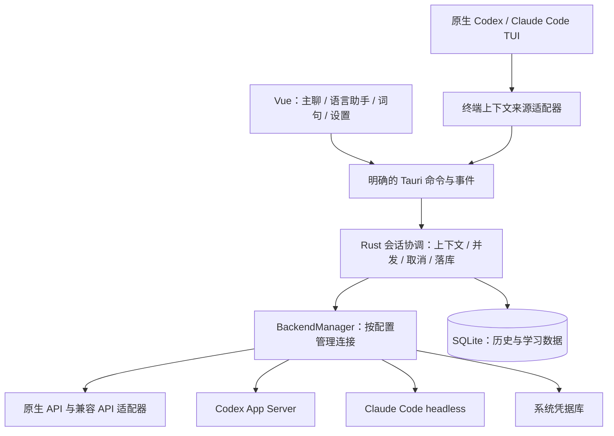

# 多模型后端开发计划

状态：**开发中，Diesel 业务迁移已完成，API 与 Claude Code 接入继续推进，尚未达到首版交付条件**。基于 v0.3.0 / `55cb6a5`；文档与官方接口核对日期：2026-09-14。作为 v0.4.0 的主线，保留 Vue + Rust + Tauri 技术栈。具体增量与验证见 [实现记录](MULTI_BACKEND_IMPLEMENTATION.md)。

2026-09-14 技术决策更新：用户选择 **Diesel** 作为 Rust 与 SQLite 的业务访问层。P1 增加存储层迁移，新增 API 工作同时遵守此决定；完整交付范围保持不变。

## 1. 交付目标

让主对话和语言助手分别选择后端与模型，并且可以同时生成。例如：主聊用 Codex，语法解释用 DeepSeek；主聊用 Claude API，翻译用 Gemini；终端运行原生 Claude Code，旁边 GUI 用 OpenAI API 答疑。

首版必须同时具备以下三类能力，不能只交付一个通用接口骨架就视为完成：

| 类型           | 首版支持                                                                          | 使用方式                                                    |
| -------------- | --------------------------------------------------------------------------------- | ----------------------------------------------------------- |
| 原生模型 API   | OpenAI、Anthropic Claude、Google Gemini                                           | 用户自己的 API 凭据；Rust 直接连接服务                      |
| 兼容模型 API   | DeepSeek、通义千问、Kimi、GLM / Z.AI，以及自定义 OpenAI Chat Completions 兼容服务 | 提供厂商预设，并允许设置服务地址、区域和模型                |
| 本机智能体 CLI | Codex、Claude Code                                                                | 用户选择本机可执行文件；支持下述 GUI 接入及原生终端伴随模式 |

“同时支持”包含主聊和助手跨后端并发，以及一个厂商保存多个配置。首版不做同一问题广播给多个模型、自动择优、自动跨厂商重试或账号池。

语言学习闭环继续可用：目标语言对话、母语答疑、翻译、选词解释、保存词句与注释、来源回看、备份导入、离线复习。纯 API 用户无需安装任何 CLI；没有可用模型时仍可使用本地学习数据。

## 2. 接入协议与认证边界

### 2.1 API 适配矩阵

| 后端             | 首选协议                         | 实施约束与依据                                                                                                                                                            |
| ---------------- | -------------------------------- | ------------------------------------------------------------------------------------------------------------------------------------------------------------------------- |
| OpenAI           | Responses API，SSE               | 单独适配类型化事件，不按 Chat Completions 的 delta 格式解析。[官方流式文档](https://developers.openai.com/api/docs/guides/streaming-responses)                            |
| Anthropic Claude | Messages API，SSE                | 按内容块和消息生命周期处理正文、usage 与流内错误。[官方流式文档](https://platform.claude.com/docs/en/build-with-claude/streaming)                                         |
| Google Gemini    | Interactions API，原生流式接口   | 当前官方推荐新项目使用；计划采用本地历史、`store=false`。P0 固定事件契约并验证多轮所需内容块。[官方接口说明](https://ai.google.dev/gemini-api/docs/interactions-overview) |
| DeepSeek         | OpenAI Chat Completions 兼容接口 | 显式处理模型参数和推理内容差异。[官方接入说明](https://api-docs.deepseek.com/)                                                                                            |
| 通义千问         | DashScope OpenAI 兼容接口        | 配置区域及对应端点，不把不同区域的密钥和地址混用。[官方兼容说明](https://www.alibabacloud.com/help/en/model-studio/compatibility-of-openai-with-dashscope)                |
| Kimi             | OpenAI Chat Completions 兼容接口 | 模型和端点以用户所属服务区域为准。[官方概览](https://platform.kimi.ai/docs/overview)                                                                                      |
| GLM / Z.AI       | OpenAI Chat Completions 兼容接口 | 首批验证 Z.AI 端点；中国区智谱端点另列验证结果，不混称已验证。[官方兼容说明](https://docs.z.ai/guides/develop/openai/python)                                              |
| 自定义兼容服务   | 显式选择 Chat Completions 协议   | 支持自定义地址和模型 ID；仅承诺通过兼容测试的能力                                                                                                                         |

厂商名称与协议类型分开保存。同一厂商未来增加 Responses 等协议时新增配置选项，不通过 URL 或品牌名猜协议。模型列表优先读取服务端；没有发现接口时允许手动填写模型 ID。内置建议带更新时间，不硬编码“最新模型”或假定所有账号可用。

首版只承诺文本学习任务。图像、语音、联网搜索、文件工具、MCP、云端代理和复杂工作流后续扩展；Azure、Bedrock、Vertex、OpenRouter 等单独验证后再增加预设。

### 2.2 Codex

GUI 保留官方 `codex app-server` 接入及其管理的认证；沿用用户选择的本机 Codex 和已有登录。终端继续直接运行原生 Codex TUI，保留快捷键、工具、历史和官方登录交互。App Server 本身提供产品集成所需的认证、线程、模型与流式能力。[官方 App Server 文档](https://learn.chatgpt.com/docs/app-server)

将当前已验证的配置限制、账号校验、线程恢复和错误提示一起迁入适配器。启动前检查实际路径、版本和能力，不把某个版本支持的配置强塞给旧 CLI，也不绑定、静默安装或升级 CLI。

### 2.3 Claude Code：两个明确入口

1. **原生终端伴随**：启动用户自己的、未经修改的 Claude Code 二进制，由用户在官方程序中登录和使用其订阅或 API 凭据。Parley GUI 提供独立语言助手及本地上下文同步。
2. **GUI 程序化后端**：Rust 使用官方 CLI 的 headless 模式，首版配置用户自己的 API Key，不自动借用 Claude.ai 的订阅 OAuth 作为 Parley GUI 的模型凭据。

这个区别来自官方认证要求：第三方应用应使用 API Key 或受支持的云认证，不能在自己的应用中提供 Claude.ai 登录或代用户路由订阅凭据；终端用户直接登录未经修改的 Claude Code 则有明确说明。[Claude Code 官方认证与合规说明](https://code.claude.com/docs/en/legal-and-compliance)

设置分别显示“Claude API”“Claude Code（API 凭据）”“Claude Code 终端伴随”，解释各自使用哪一项服务额度。API 用量与 CLI 订阅限额分别显示；服务未提供余额时显示“未知”，不推算为统一剩余额度。

## 3. 当前代码需要拆开的耦合

| 当前位置                             | 问题                                                              | 计划改动                                             |
| ------------------------------------ | ----------------------------------------------------------------- | ---------------------------------------------------- |
| `src/features/codex/store.ts`        | 工作区、消息、模型、认证和连接混在一个 store，存在全局 ready 状态 | 拆分工作区、会话与后端配置；主聊和助手分别判断可用性 |
| `src-tauri/src/codex.rs`             | 全局单个 Codex client，并直接承担会话与存储协调                   | 保留协议实现，通用调度、消息落库和事件路由上移       |
| `src-tauri/src/storage.rs`、迁移 001 | 会话绑定 `thread_id`、账号和 Codex signature                      | 增加通用后端绑定及 turn 记录，兼容旧线程恢复         |
| `src-tauri/src/launcher.rs`          | 启动参数、GUI 上下文和执行路径只认识 Codex                        | 加入 CLI 后端选择，保留现有参数与原生 TTY 行为       |
| `src/features/terminal/context.ts`   | 终端来源默认是 Codex thread                                       | 来源显式携带后端和会话命名空间                       |
| 词句编辑、选词与复习组件             | 通过 `useCodexStore` 请求解释、翻译和练习                         | 改为调用通用助手入口，保留请求与草稿版本绑定         |
| `src/shared/use-workspace-window.ts` | 关闭时只断开 Codex                                                | 统一保存、取消和回收多个后端，保持有界关闭           |
| `src-tauri/src/exchange.rs`          | 词句备份 v1 严格字段解析                                          | 后端来源元数据采用新版格式，继续支持导入 v1          |

先将 Codex 迁到新接口并通过现有回归，再接其他服务。不能只把 `useCodexStore` 改名，内部仍依赖一个全局账号或线程。

## 4. 目标架构与核心契约



### 4.1 类型与职责

- `BackendProfile`：稳定 ID、名称、厂商、协议、配置版本、端点/区域、凭据引用或 CLI 路径。允许同厂商多个配置。
- `ModelRef`：`profileId + modelId`。模型名相同但服务不同，仍是不同选择。
- `BackendCapabilities`：模型发现、流式、取消方式、远程续聊、用量报告及可用参数；不支持的选项在 UI 隐藏或禁用。
- `ConversationBinding`：配置版本、认证范围、模型、语言和 prompt 版本；远端会话句柄可空。API 本地历史不伪造 Codex thread。
- `TurnSnapshot`：发送瞬间固定配置、模型、上下文、语言、来源和词句草稿请求 ID。生成中修改设置不能改变在途请求归属。
- `ContextSource`：读取终端上下文的独立接口。读取来源不需要把同一个 CLI 设为 GUI 的推理后端。

Rust 后端契约提供 `probe`、`list_models`、`start_turn`、`cancel` 和 `disconnect`；具体 RPC、SSE、JSONL 和远端 session 结构只存在于适配器。前端使用 `useBackendStore`、`useChatStore`、`useWorkspaceStore`，词句功能仅依赖助手发送接口和稳定的本地消息 ID。

建议目录为 `src-tauri/src/backends/{mod,manager,types,codex,claude_code,openai,anthropic,gemini,openai_compatible}.rs`、`src-tauri/src/chat/`、`src-tauri/src/terminal_sources/`、`src/features/backends/`、`src/features/chat/`。按模块实际复杂度拆分，不预建空框架。

### 4.2 流式事件、并发与生命周期

统一事件携带 `profileId`、配置版本、连接代次、`conversationId`、`pane`、本地 `turnId`、请求 ID、本地消息 ID 与序号。上游 thread/session/turn/item ID 作为独立元数据保存，不直接作为跨后端全局主键。

生命周期为 `accepted → streaming → completed | cancelled | failed | interrupted`。每个 turn 只有一个终态；正文先落库再发送界面更新，最终整段正文与已收 delta 对齐，不能再次追加。连接 EOF、CLI 退出码 0 均不能代替协议中的完成确认。

主聊与助手各自可生成一条回复，并能跨后端并发。取消只作用于目标 turn：共享 Codex App Server 时调用对应中断；Claude headless 只回收自己创建的进程及其子进程；API 关闭对应流。取消 API 请求不承诺服务端立即停止计费。

断开一个配置不能使其他后端变成未连接。关闭窗口先保存词句和草稿，再取消活动请求、回收连接；多个回收过程并发等待统一截止时间，不能因后端数量增加而无限延长关闭。异常退出保留部分正文并标记中断，重启不自动重发。

错误分为配置、认证、能力不支持、限流、额度不足、网络、上下文超限、流中断、进程退出和存储失败；保留脱敏后的服务错误码。应用不自动切换厂商或重试可能已经开始计费的生成；用户显式重试创建新 turn。

### 4.3 上下文与切换规则

API 默认由本地保存并组织多轮历史。服务支持时显式关闭响应对象存储，不把该开关描述为服务商完全不留日志。系统指令按协议映射；可见正文与续聊必需的原生内容块分开保存，不能把推理签名等续聊数据简单压成字符串。原生状态仅在相同后端绑定内使用，也不展示为词句来源。

上下文预算先用服务端能力或 tokenizer 信息，缺失时使用保守估算并标明估算。超长历史按完整轮次裁剪并提示；不静默调用另一个模型总结。解释和翻译只携带所选原句、必要相邻消息和用户问题。

切换后端或模型默认创建新会话，旧会话保持原绑定。用户可显式选择“带入当前可见历史”，生成新会话快照，不迁移远端 session ID 或协议私有内容。切换前保存草稿；在途回复仍返回原会话。更换凭据、端点或 CLI 登录账号后重新验证绑定，不能把旧远端线程交给另一个账号续聊。

## 5. 后端实施细节

### 5.1 API 与凭据

使用 Rust HTTP 客户端与独立的 SSE 解析层；所有模型请求留在 Rust，WebView 不直接访问模型域名。兼容适配器共享协议处理，厂商参数映射和 fixture 已按 [兼容记录](BACKEND_COMPATIBILITY.md) 落地；真实服务验收单列。不能不断添加无依据的字段重试。

API Key 保存到系统凭据库：Linux Secret Service、macOS Keychain、Windows Credential Manager。SQLite 仅保存引用。密钥输入提交后清空，IPC 只返回“已配置”等状态；不回显旧密钥，不进入日志、错误正文、词句备份或普通设置导出。凭据库不可用或锁定时提供仅本次会话使用，不回退到明文文件。

端点默认 HTTPS；本机兼容服务器可以明确配置回环 HTTP。凭据绑定所选主机，不向重定向后的其他域名转发认证头。代理与自定义参数在 Rust 侧校验；启动 CLI 时限制新增凭据环境变量的作用范围，避免把另一个厂商的密钥一并传入。

“检查连接”只做能力、认证或模型列表检查；需发送模型文本的“测试对话”独立显示，并说明会产生调用用量。未实现模型列表的服务仍可手动选模型使用。

### 5.2 Claude Code headless

优先直接启动官方 CLI，使用流式 JSON 输出，不为 API 用户增加 Node 运行时或常驻 SDK sidecar。按官方 headless 协议解析事件与最终结果，精确记录 session ID；续聊从上次成功轮次的指定 ID 创建新分支，不使用“继续最近会话”。失败轮次的分支不会被下一轮恢复。[官方 headless 文档](https://code.claude.com/docs/en/headless)

本机 `Claude Code 2.1.269` 已通过回环服务验证：有效工具/MCP/技能为空、API Key 认证、两轮流式、指定会话分支续聊及服务错误退出。运行时检查所需参数能力，并检查每轮初始化；目前仅该版本有实际 CLI 证据，未进行真实厂商模型调用。

实现采用 bare / restricted 模式、明确的纯聊天 system prompt、关闭内置工具、技能、hooks 和 MCP 工具。`--bare` 本身不能代替工具禁用；`--tools ""` 也不影响 MCP，必须分别约束并检查有效初始化配置。官方 CLI 参数是实施依据，不通过 prompt 假装完成进程隔离。[官方 CLI 参数](https://code.claude.com/docs/en/cli-reference)

用户文本通过 stdin 传入，使用参数数组启动，不拼接 shell；API Key 仅传给该子进程。使用专用工作目录，避免自动加载用户项目上下文。若组织管理策略或该版本使必需的纯聊天限制无法落实，明确显示该 GUI 接入不可用，并提供直接 Claude API 的配置入口；不绕过权限设置。stderr 独立采集并脱敏，取消和超时必须回收进程。

### 5.3 原生终端伴随

开发分支已实现以下语法，现有命令继续兼容；交互式 TUI 与完整桌面联动仍待验收：

```bash
parley-cli                                  # 保持默认 Codex
parley-cli --codex /path/to/codex -- resume --last
parley-cli --backend codex -- <原生参数>
parley-cli --backend claude-code -- <原生参数>
parley-cli --backend claude-code --claude /path/to/claude
```

GUI 助手使用设置中独立选择的后端。官方 CLI 直接占用当前终端，参数边界、退出码和信号保持一致；不重画一个 Codex/Claude Code TUI，不依赖复制粘贴。

Codex 保留当前只读历史同步。Claude Code 使用每次启动生成的临时 hooks 插件，通过 `--plugin-dir` 添加到该次原生进程；用户的 `--settings` 和其他插件参数原样保留。GUI 通过带启动令牌的回环 HTTP 接收 session/prompt/stop 事件，使用 Stop 的 `last_assistant_message` 获取回答；不读取 ANSI 屏幕或 transcript 文件，也不全局改写用户 hooks。[官方 hooks 文档](https://code.claude.com/docs/en/hooks)

hook 接收器限制载荷大小、验证本次启动令牌与来源，成功后静默退出，不向原生会话注入额外指令。用户配置与管理策略需要合并和检测。hook 不可用时原生 CLI 仍可正常工作，GUI 明确显示自动同步不可用，不伪装为已获取上下文。

Claude 首版至少同步启动后的新轮次及最近六轮；恢复会话在启动前的历史读取是 P0 专项验证，只有找到并验证稳定的官方读取方式才承诺完整回看。选择来源时显示“后端 + 会话”，多候选不猜测。界面标明“将向哪一个助手服务发送所选内容”，同步本身不调用模型，解释和翻译由用户触发。

## 6. 持久化与迁移

### 6.1 Diesel 强类型存储层

采用 Diesel 的 SQLite 查询 DSL、`Queryable` / `Selectable` / `Insertable` 等类型映射，集中维护 `schema.rs`、数据库记录类型及 repository。业务层通过明确的方法读写数据，不再散落 SQL 字符串、列名字符串和 `row.get(0)` 位置映射。Diesel 支持 SQLite 与类型化查询、结果映射。[官方指南](https://diesel.rs/guides/getting-started.html)

保留 SQLite 文件格式、当前表和主键、`user_version` 版本链、升级前备份及单写入者约束；更换访问库不要求用户导出重建数据库。历史 SQL 迁移不可改写。迁移 DDL、PRAGMA、备份等 SQLite 专用操作可集中保留原生 SQL，并说明用途；普通增删改查、条件筛选、联表与事务使用 Diesel DSL。

连接继续在 Rust 管理，同步 SQLite 操作在阻塞任务中执行；一个业务事务只使用同一连接。库迁移期间如需兼容桥接，必须共享同一事务边界，不能用两个独立连接拼接一个逻辑事务。依赖锁定并验证 `libsqlite3-sys` 的 bundled SQLite 兼容性。

迁移顺序：

1. 引入 schema、记录类型、统一存储错误与连接/事务封装，先覆盖后端配置和凭据引用。
2. 将 API turn 与协议内容、工作区、会话和消息改为强类型查询。
3. 迁移词句、来源、草稿、复习、标签和备份导入中的业务查询。
4. 移除过渡访问层和不再需要的 `rusqlite` 依赖；检查剩余原生 SQL 仅属于明确的 SQLite 专用操作。

验收必须复用当前数据库迁移、并发隔离、事务回滚、词句来源、备份往返和复习幂等测试，并增加从 v3/v4 数据库升级后继续读取历史的验证。编译期检查查询与记录类型；实际表结构和 Diesel schema 的一致性另通过迁移测试确认。

### 6.2 多后端数据迁移

当前数据库版本为 6，已完成从 v3/v4/v5 的升级测试。迁移 004、005、006 已落地；历史迁移不改写：

| 迁移                                | 内容                                             | 必须保持的性质                                                      |
| ----------------------------------- | ------------------------------------------------ | ------------------------------------------------------------------- |
| `004_model_backends.sql`（已实施）  | 后端配置、不可变配置版本、会话绑定               | 原 conversation/message ID 及词句外键不变；配置不含明文凭据         |
| `005_api_turns.sql`（已实施）       | 凭据引用、API turn、实际输入、协议续聊内容及用量 | 按配置版本、凭据作用域与序号隔离；完成不可被迟到事件覆盖            |
| `006_source_backends.sql`（已实施） | 终端来源的后端与外部会话命名空间                 | 同名 thread/session/item 不跨后端碰撞；原句快照、哈希和选区偏移保留 |

旧偏好生成一个 Codex 配置，继承原 CLI 路径、主模型和助手模型；没有路径时保持待配置，不猜另一个可执行文件。已有 Codex 会话保留账号与 signature 校验，提供旧签名版本适配，不能因新结构变化把全部历史判为无法恢复，也不能跳过原本的账号校验。

配置更新递增版本；历史绑定可保留所需的非敏感快照。被历史引用的配置采用停用或保留归档元数据，删除凭据不删除会话和词句。凭据库与 SQLite 不共享事务：先写入新凭据槽，再事务提交引用，失败时清理新槽，提交后才清理旧槽。

词句备份已升级到 v2，以容纳后端类型、厂商及已知模型；继续导入 v1，旧终端来源按命名空间恢复为 Codex / Claude Code，手动来源保持无后端。仍有关联的本地对话从不可变配置版本补全；已失去关联且无后端字段的旧对话保留“后端未知”，不猜测厂商。已有导入幂等键及来源去重需要兼容映射，防止同一份 v1 再导入产生重复收藏。备份不包含 API Key、CLI 登录凭据或完整后端配置。未知未来版本明确拒绝，导入失败不部分写入。

迁移前提供数据库备份，事务失败保持原库；升级后的库不交给旧程序写入。关闭保存、词句请求版本、删除会话后仍可读原句快照、复习评分重试等现有一致性保证都属于回归范围。

## 7. 设置与学习界面

设置新增“模型服务”：创建配置 → 选择厂商/协议 → 填写凭据或 CLI 路径 → 检查 → 选择模型。支持编辑、停用、删除凭据和独立连接状态。

主聊与助手各自有“配置 / 模型”选择器和生成状态。API 已展示服务返回的 token 用量，并在读取历史时恢复；不自行补全缺失计数，费用只在有可靠计价依据时显示估算；Codex 保留官方限额信息；无法查询时显示未知。连接一个后端失败不会覆盖另一个的状态。

词句相关按钮取决于助手后端是否可用；离线编辑、标签、导出和复习不依赖模型连接。异步解释仍绑定到原词句及草稿版本，不能将迟到回复写入用户后来打开的另一张词卡。来源已显示后端和原句；通过稳定本地会话 / 消息 ID 跳转并定位，读取失败保持词句视图与快照。外部终端来源仅保留快照，不伪装为本地可跳转会话。

长流式输出按短时间窗口批量更新视图，避免每 token 重绘词句列表；启动不强制连接全部配置或为每个配置拉取模型。当前机器已安装应用的 WebKit 环境修复属于本机启动配置，本计划不将其写进跨平台后端逻辑。

## 8. 开发阶段与工作量

按单人集中开发估算，共 **25–37 个工作日，约 5–8 周**；其中新增 Diesel 迁移约 3–5 天。不包含等待各服务账号、API 凭据或平台设备。先跑通旧 Codex 与一个真实 API 的完整纵向流程，再扩展接口；存储迁移按 repository 分批完成。

| 阶段                         | 工作量 | 交付                                                                                              | 验收门槛                                                                             |
| ---------------------------- | ------ | ------------------------------------------------------------------------------------------------- | ------------------------------------------------------------------------------------ |
| P0：协议与能力验证           | 2–3 天 | 固定 CLI 版本、API 事件契约、Claude 认证与工具限制、终端 hooks 小实验；记录 Gemini 无状态多轮方案 | 流式、续聊、取消与有效限制有证据；未验证能力明确记录                                 |
| P1：通用会话层与 Diesel 迁移 | 6–9 天 | 新契约、store 拆分、配置及会话迁移、Codex 适配；所有业务 repository 改用 Diesel                   | 旧数据可开、双会话可续聊，事务回滚及词句/复习不退化；普通业务查询不再使用 SQL 字符串 |
| P2：原生 API                 | 4–6 天 | 凭据库、HTTP/SSE、OpenAI、Claude、Gemini；先完整打通 OpenAI                                       | 纯 API 环境独立可用，三种协议均可多轮、流式与取消                                    |
| P3：兼容 API                 | 2–3 天 | DeepSeek、千问、Kimi、Z.AI 预设及自定义服务                                                       | 参数映射和错误有 fixture，每个厂商实测记录单独列明                                   |
| P4：Claude Code GUI 后端     | 3–4 天 | headless 生命周期、API 认证、指定 session 恢复与能力诊断                                          | 与另一后端并发不串流，工具限制生效，异常退出可恢复                                   |
| P5：双 CLI 终端伴随          | 3–5 天 | launcher 参数扩展、Claude 局部 hooks、来源隔离                                                    | 原生快捷键与登录保留，新回复自动同步，无需复制，故障可见                             |
| P6：设置与学习闭环           | 3–4 天 | 两区选择、状态与用量、词句来源迁移、v2 备份                                                       | 跨后端选词解释、保存、重启、导入及离线复习完整走通                                   |
| P7：发布验证                 | 2–3 天 | 兼容矩阵、安装包、用户文档与回归记录                                                              | 满足下方首版清单；构建验证与实际运行验证分开记录                                     |

P1、P2 开始就提供可操作的最小设置界面，P6 补齐最终交互。迁移分阶段交付；终端来源迁移和备份 v2 与 P5/P6 一起验收，避免提前发布无法解释的新字段。

## 9. 测试与发布验收

### 自动化测试

- API 协议：UTF-8 跨包、SSE 分片、空块、仅 usage 事件、服务端流内错误、缺失终态、未知字段和异常大载荷；按三种原生协议及兼容变体分别建 fixture。
- CLI 协议：JSONL 分片、stderr 混杂、能力缺失、无结果退出、登录失败、取消与子进程回收；不能把进程成功退出当作模型回答完成。
- 路由：主辅并发、相同上游 ID、配置更换、旧连接迟到事件、重复最终消息；只取消目标 turn，掉线不影响其他配置。
- 数据：v3 升级、旧签名续聊、凭据写入失败补偿、词句外键、来源去重、v1/v2 导入幂等、崩溃中的部分正文及草稿恢复。
- 学习流程：解释请求发出后换词卡、切会话或换后端，回复仍只属于原请求；离线 CRUD 与复习保持可用。
- 凭据与边界：日志及导出脱敏、认证头不跨主机转发、GUI Claude 调用不继承订阅 OAuth、纯聊天工具限制、终端原生参数与信号透传。

### 真实服务与桌面验收

每个列入首版的 API 厂商，以及 Codex、Claude Code GUI 后端，都需要至少一次低用量的多轮流式实测，并记录模型、协议/CLI 版本、日期、取消结果与已知限制。没有凭据的服务只能标为“fixture 验证，真实调用未验证”，不能声称全部已支持并验证。

必须覆盖这些组合：Codex 主聊 + API 助手、API 主聊 + Codex 助手、不同 API 的双面板、Claude Code GUI + API，以及两个原生 CLI 各自搭配 API 助手。验证其中一个后端失败时另一个仍可回答。

在 Linux 实际安装包中完成登录/配置、中文输入法、流式停止、终端同步选词、解释保存、关闭重开、备份导入及复习。API-only 安装不要求 Codex、Claude Code 或 Node；CLI 模式使用用户配置的二进制。Windows/macOS 构建检查和原生运行检查分别记录，不以编译通过代替平台可用。

首版发布清单：

- [ ] 七个厂商预设、自定义兼容接口、Codex 和 Claude Code 两种模式具备明确状态和兼容记录。
- [ ] 主聊与助手可独立选择并同时生成，一个失败或取消不影响另一个。
- [ ] 原有 Codex 登录、历史、TUI 操作和自动上下文功能无退化。
- [ ] Claude 原生终端新轮次自动同步；历史读取范围与不支持条件在 UI 和文档中明确。
- [ ] 纯 API 模式无需安装 CLI；密钥有安全存储与仅本次会话选项。
- [ ] 重启、换后端、换账号、换配置后不串会话、不重复发送、不丢草稿。
- [ ] 旧词句、来源、标签和复习记录迁移成功；v1/v2 备份往返与幂等通过。
- [ ] 流式正文、错误与终态一致，关闭时间有界，无遗留的 Parley 托管进程。
- [ ] 仓库要求的格式、类型、Rust 检查和现有测试通过；新增协议与迁移测试通过。
- [x] Diesel 接管业务查询与事务，schema 与迁移后的实际表一致；原生 SQL 限于迁移和明确的 SQLite 专用操作。
- [ ] 安装说明、后端设置说明、认证区别、兼容矩阵和实际验收记录齐全。

按上述阶段持续推进实现；当前文档不代表所有列出的后端已经可用。
