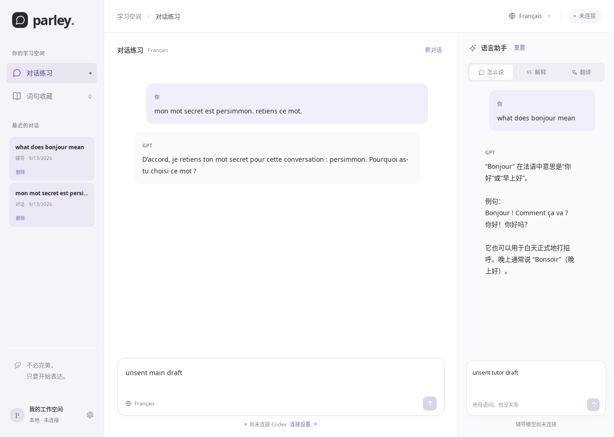

# 本地持久化

Parley 在 Rust 侧使用 SQLite 保存工作区数据。正常退出或重新启动后，无需登录即可查看已保存的消息与草稿；继续请求模型时再连接自己的 Codex 账号。

工作区持久化从 v0.1.0 开始；v0.3.0 增加词句、草稿、标签与复习数据。

## 保存内容

- 词句、释义、注释、独立来源快照、编辑草稿、标签、复习卡和评分/撤销历史。
- 母语、目标语言、主聊与辅导模型、辅导模式、当前视图。
- 当前主聊/辅导会话、每个会话的未发送草稿。
- 两个面板的历史会话、消息顺序、完整回复、已收到的部分回复及中断/失败状态。
- 本地会话与 Codex thread 的映射、创建时的模型和语言配置、用于防止串账号恢复的账号邮箱。认证令牌仍由 Codex 管理，不写入 Parley 数据库。

主面板“新对话”和辅导面板“重置”会创建新会话，旧记录保留在左侧历史列表。点击历史条目可离线切换；相应面板仍在生成时不可切换或删除。修改语言、模型或辅导模式后发送消息，会新建会话并保留旧记录。

删除条目需要在界面中再次点击“确认删除”。操作删除该会话的本地消息和草稿，不删除其他会话，也不删除 Codex 自己的运行日志。

## 数据位置与备份

确切路径显示在“学习设置 → 本地数据”。使用 Tauri `app_local_data_dir`，通常为：

- Linux：`~/.local/share/org.parley.desktop/parley.sqlite3`，遵循 `XDG_DATA_HOME`。
- macOS：`~/Library/Application Support/org.parley.desktop/parley.sqlite3`。
- Windows：`%LOCALAPPDATA%\org.parley.desktop\parley.sqlite3`。

数据库未加密，请按自己的本机文件保护需求管理。备份前关闭所有 Parley 窗口，再复制该目录中的 `parley.sqlite3`；如果仍存在 `parley.sqlite3-wal` 和 `parley.sqlite3-shm`，一并保存，不能在应用写入时只复制主文件。恢复时同样先关闭应用，再替换整组数据库文件。`parley.lock` 只是进程锁文件，不含学习数据，锁随进程退出释放。

词句页提供 JSON 备份/导入及 CSV 导出，具体范围见[词句学习指南](VOCABULARY.md)；这些文件不包含完整工作区或编辑草稿。仅备份 Parley 数据库可以恢复离线记录；继续原模型上下文还需要原账号及 Codex 自身保存的对应 thread。不要删除 Codex 自身记录后期待 Parley 自动重建它。

## 一致性和恢复行为

- SQLite migration 001 创建 `preferences`、`conversations`、`messages`，使用事务、外键、WAL 与 `synchronous=FULL`。迁移失败回滚；遇到更新版本的 schema 拒绝写入，保留原库。
- migration 002 添加词句、来源、草稿、幂等写入和导入映射；003 添加标签、复习卡和评分历史。004 添加不可变后端配置和会话绑定，005 添加模型轮次、凭据引用与用量，006 添加词句后端来源。当前 schema 为 6，升级保留原会话。旧版不能打开升级后的数据库，回退需要升级前的备份。
- SQLite 业务查询与事务通过 Diesel DSL 执行；DDL、PRAGMA 和升级前备份集中保留 SQLite 专用 SQL。升级前生成可独立读取的 `parley-before-v6-*.sqlite3`，来源补全与迁移在同一事务内完成，失败回滚。
- 词句来源保留后端类型、厂商和已知模型；删除聊天后仍可查看这些信息与原句。旧记录无法确定的后端显示未知。
- 词句写入使用 revision 与 request ID 防止旧编辑覆盖或重试重复；原句用复合消息键关联，删除聊天后解除链接并保留快照。词句草稿及在途数据交换、评分会纳入关闭等待。
- 草稿与设置串行保存，快速输入会合并为下一次最新状态写入。窗口关闭前等待保存队列完成，再让 Codex 正常退出。
- 用户消息在请求模型之前写入；流式消息在向界面发送对应增量之前写入。最终 item 按唯一 ID 更新，不重复插入。
- API / Claude Code GUI 的用量按本地会话 ID 与助手消息 ID 联表恢复，不会因不同后端使用相同上游标识串到另一条回复；未提供新用量的终态保留先前已报告的计数。
- 意外退出后，数据库中未完成的请求/回复标记为“已中断”，保留已经提交的内容。尚未提交的最后一次键入可能丢失；不会自动重发旧消息。
- 写入失败会明确提示并保留当前草稿；修复磁盘空间/权限后可重试。读库失败时不会把默认设置覆盖进去。无法保存但仍需退出时，可明确选择放弃未保存修改。
- 同一数据库同时只允许一个 Parley 进程持有写入锁；另一个窗口会显示原因，并允许在首个窗口退出后重新读取。
- 使用持久 Codex thread；重新连接或重启后，首次续聊调用官方 `thread/resume`，再发送新消息。进程重连会等待旧进程退出，避免上游 writer lease 冲突。
- 只允许原 ChatGPT 账号恢复已绑定 thread；账号不同或无法确认时保留离线记录，提示登录原账号或新建对话。上游 thread 丢失时明确报错，不静默换成失去上下文的新 thread。

## 已验证范围

- Rust 测试：数据库关闭/重开、Unicode 草稿和消息、部分回复恢复、事务回滚、重复消息、级联删除、版本保护、进程锁，以及账号隔离。
- Vue 测试：启动恢复、默认值覆盖保护、顺序保存、最新草稿 flush、保存失败与重试、历史切换前保存。
- Linux Tauri/WebKit：真实窗口关闭、重启、离线恢复法语设置及双侧草稿/消息，重新连接后沿用同一个 thread 回答重启前的练习词。另有真实 App Server 重启恢复测试。
- Windows/macOS 编译、Clippy 与自动测试通过，尚未真机验证。词句专项验证见[实现记录](VOCABULARY_IMPLEMENTATION.md)。

