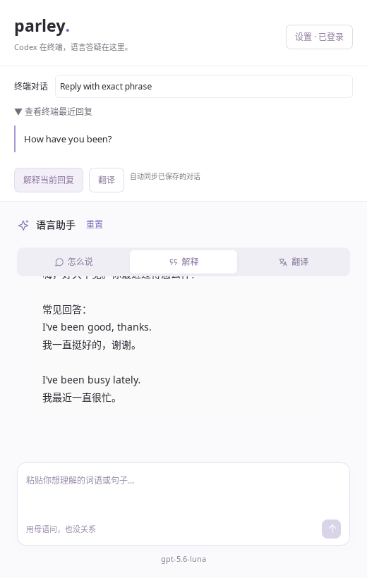

# 终端伴随模式

Parley 的 `parley-cli` 默认是官方 Codex TUI 的启动入口，旁边的独立 Tauri 窗口负责语法解释、翻译和母语答疑。使用用户在设置中指定的 Codex，不内置 CLI 或固定版本。

## 启动

在源码工作区先构建两个程序：

```bash
npm run cli:build
npm run cli
```

`cli:build` 构建包含前端产物的桌面程序和控制台启动器。修改源码后重新运行此命令。GUI 开发可单独使用 `npm run tutor:dev`；完整工作台仍使用 `npm run desktop:dev`。

未配置路径时，macOS / Linux 可以直接指定：

```bash
npm run cli -- --codex "$(command -v codex)"
```

启动器把原生参数从 `--` 之后或第一个非 Parley 参数开始原样传给 Codex：

```bash
npm run cli -- resume --last
npm run cli -- -- -m gpt-5.6-luna
npm run cli -- --no-gui -- --help
```

直接在任意工作目录调用构建后的 `target/debug/parley-cli`，即可使用该目录作为 Codex 工作目录；`-C` / `--cd` 仍可指定工作目录。控制台启动器应与 `parley` GUI 可执行文件放在一起，也可用 `--gui-bin` 指定 GUI 文件。Windows 使用对应 `.exe`；跨平台配置已提供，本次只实测 Linux。

## 自动上下文

- GUI 使用官方 App Server 的 `thread/list` 和 `thread/turns/list` 读取当前工作目录的 CLI 会话，每次请求完成后间隔约 2 秒再刷新。
- 只有本次启动后创建、且唯一匹配的新会话才自动关联。不会自动猜测多个终端中的目标。恢复旧会话时，在下拉框选择一次；TUI 内切换 `/new` 或恢复其他会话后，也可从该列表改选。
- 同步 Codex 已落盘的最近六轮，不镜像逐 token 的终端画面。短暂延迟是正常的；关闭历史记录、远端会话、不同 `CODEX_HOME` 或不兼容的历史分页接口可能无法同步。
- 只保留用户文本与助手回复，不读取推理和工具输出。提问自动携带最近十二条消息（六轮普通对话）中最多 5,000 个字符；有选中片段时，优先保留片段。
- 点击“解释当前回复”或“翻译”可直接提问。展开“查看终端最近回复”后，在 GUI 中选中词句即可针对片段答疑，无需操作剪贴板。终端本身的鼠标选区不跨窗口传递。
- 同步本身不调用模型；点击解释、翻译或发送问题才使用辅导模型。

实际联动截图：



## 原生行为与数据

Codex 模式下，启动器不注入主对话 prompt 或配置，不解析终端输出，不改变 Codex 的工具、审批、快捷键、模型与历史。Linux/macOS 通过 `exec` 将终端进程交给官方 CLI，保留 stdin/stdout/stderr、退出码及信号行为。语法 GUI 独立运行，关闭任一端不会要求另一端同时退出。

终端会话由 Codex 管理；Parley 数据库保存 GUI 辅导消息、设置和草稿。自动上下文作为辅导模型本轮的引用材料发送，不作为新的主对话消息写入 Codex TUI，也不接管主会话的写入锁。关联选择本身不持久化，重启后按新启动时间重新匹配或手动选择。

如果已经有 Parley 工作区窗口打开，启动器会提示先正常关闭已有窗口，避免两个 GUI 同时写同一数据库。只需要启动终端时可使用 `--no-gui`。

协议依据：[Codex CLI](https://learn.chatgpt.com/docs/cli)、[App Server 的会话读取接口](https://learn.chatgpt.com/docs/app-server)。

## Claude Code

源码构建后可以运行用户安装的原生 Claude Code，并让语法窗口使用设置中单独选择的助手服务：

```bash
npm run cli:build
target/debug/parley-cli --backend claude-code --claude /path/to/claude
target/debug/parley-cli --backend claude-code --claude /path/to/claude -- --resume SESSION_ID
```

省略 `--claude` 时，读取设置中唯一的已启用 Claude Code 路径；存在多个不同路径时要求显式选择。原生终端保留官方登录、用户配置、工具及交互；GUI 助手使用 API 时仍消耗对应 API 额度。

启动器为这次运行添加一个局部 hooks 插件，用户已有的 `--settings` 与 `--plugin-dir` 参数保持有效。每次事件直接执行本机 `parley-cli` 回调，将可见用户输入和完成回答写入私有缓存；原始 hooks 载荷不落盘。回调不依赖语法窗口，不向 Claude 注入文本或控制决定，也不修改全局 hooks 或解析终端画面。采用官方 [command hooks 的 exec 参数形式](https://code.claude.com/docs/en/hooks#exec-form-and-shell-form)，路径不经过 shell 拼接。

同步只覆盖本次启动后收到的最近十二条消息；恢复会话之前的历史暂不读取。选中词句后可以解释、翻译或保存，界面会显示即将接收引用内容的助手服务。来源用独立的 Claude Code 命名空间保存，避免与 Codex thread 混淆；词句 JSON v3 保留这些来源信息，可以迁移到 Web，同时支持导入旧版 v1/v2。

语法窗口关闭后，原生 CLI 继续运行，本地回调继续保存最近十二条消息。使用 `parley-cli --reconnect` 只重开当前目录最近一次伴随会话的语法窗口，不启动第二个 CLI；多个会话可以用 `--list-companions` 查看，再用 `--reconnect --session ID` 指定。关闭窗口不会再导致 HTTP hook 连接失败。`--no-gui` 完全不添加同步插件；bare / safe 模式或管理策略禁用 hooks 时，终端仍可使用，GUI 显示尚未接收到事件。

已验证 Linux 本机 Claude Code `2.1.269` 的 hooks 投递及与已有 Stop hook 共存；另通过原生已登录 TUI 完成两轮真实回复，自动同步到 GUI，并配合 API fixture 答疑及保存终端来源词句。Codex `0.154.0 / gpt-5.6-luna` 也已通过原生 TUI、API fixture 解释、收藏与 GUI 重启恢复。两项组合均从 Linux 开发 deb 解包运行，API 侧尚未调用真实厂商；Windows/macOS 原生窗口仍待验收。详细证据见[多后端实现记录](MULTI_BACKEND_IMPLEMENTATION.md)。

## 重连与缓存

上述重连入口同时支持 Codex 和 Claude Code。Codex 重连后仍通过官方历史接口读取，Claude 从本地缓存继续显示；启动前未收到的 Claude 历史仍不读取。当前源码的新入口需要重新构建，旧 alpha.2 安装包不包含这些改动。

伴随记录位于系统缓存目录下的 `org.parley.desktop/companions/<ID>`；Linux 通常为 `~/.cache/org.parley.desktop/companions`，遵循 `XDG_CACHE_HOME`。每次启动保留启动参数和至多 20 个会话、每会话最近十二条可见消息，每条最多 16,000 字符。Unix 会话目录权限为 0700，文件原子替换并由文件锁串行更新。

缓存允许终端退出后重新查看最近内容，不表示终端仍在线。结束使用后可删除对应 ID 的缓存目录；旧回调不会重建已经删除的目录。缓存不进入词句备份，只有主动收藏的原句随词句导出。
