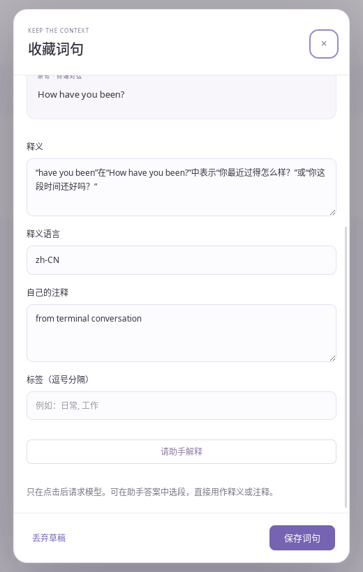
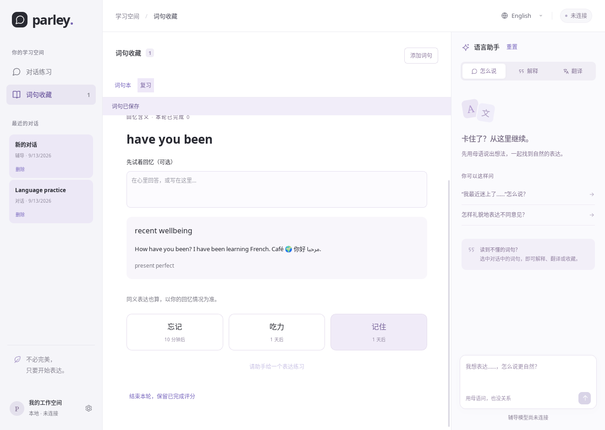

# 词句学习实现与验收

对应[原始开发计划](VOCABULARY_PLAN.md)的 P1–P6，完整包含 v0.2 收藏管理和 v0.3 复习范围，合并交付为 v0.3.0。功能实现提交为 `556e9ac`、`c7e6bda`。使用方法见[词句学习指南](VOCABULARY.md)。

## 逐阶段核验

| 阶段        | 实现及证据                                                                                                                                                                                     |
| ----------- | ---------------------------------------------------------------------------------------------------------------------------------------------------------------------------------------------- |
| P1 数据基础 | schema 002/003 按顺序事务迁移，共用 Storage 连接与进程锁；测试覆盖旧会话升级、迁移回滚、revision 冲突、幂等写入、复合消息键、删除聊天保留原句。                                                |
| P2 收藏入口 | 工作台及终端同步正文使用同一个 StudyText；提供选区、整句与手动入口。真实 Linux GUI 从终端回复选中 `have you been`，保存 thread/turn/item、快照和精确区间，无剪贴板操作。                       |
| P3 词句管理 | 分页、搜索与筛选、标签、详情、草稿、冲突比较、重复来源/多义、回收站及恢复。原生窗口未保存表单关闭后重启恢复释义和注释；实际助手答案选段直接填入草稿。                                          |
| P4 数据交换 | JSON 包含词句、来源、标签、卡片与评分；文件选择、预览、重复/冲突处理、事务导入、原子导出及 CSV。实际新工作区恢复原句、注释、标签、卡片及已撤销评分；原生文件选择取消、重复导入、覆盖确认通过。 |
| P5 复习基础 | 双方向独立卡片、固定排程、到期优先、新卡限额、暂停/重置、幂等评分和最近评分撤销。固定时钟测试覆盖全部阶梯、到期边界及方向隔离，删除/回收站/无释义不出题。                                      |
| P6 复习界面 | 提示、可选回忆输入、显示答案、三档自评、统计与可选表达练习。实际离线评分后卡片到期为 24 小时后，撤销恢复原状态且提升 revision；420px 页面与重复点击评分验证通过。                              |

## 自动测试与浏览器检查

2026-09-13，Ubuntu 24.04.5 x86_64，Node 24.18.0、Rust 1.97.1：

- `npm run check`：格式、Vue/TypeScript、rustfmt、Clippy（`-D warnings`）通过。
- `npm test`：36 项通过，包括答疑发送时固定草稿版本、迟到答案隔离、失败重试、关闭等待、来源附加时保留未提交内容。
- `cargo test --workspace --locked`：41 项通过，4 项默认跳过（3 项需真实 Codex 的测试、1 项独立性能基准）。
- JSON 回归覆盖 Unicode 完整往返、备份重复、冲突副本、预览过期、导入中途失败回滚、未知格式/超限/损坏来源/引用错误。CSV 覆盖 BOM、引号、换行与公式字符；原子写入覆盖成功替换和目标不可写的失败。
- `scripts/check-vocabulary-dom.mjs` 在实际 Chrome DOM 验证重复词定位、跨文本节点 Range、emoji 标量偏移、组合字符拒绝、跨消息拒绝、文本/来源更新冻结、键盘选择和输入法合成期间 Enter 不提交。
- 同一 DOM 脚本还检查 420px 语法窗口详情、编辑页脚、复习及连点仅一次评分。**该脚本的布局与评分 IPC 使用 fixture/mock；数据库持久化由 Rust 测试和下述原生窗口验证，不能把浏览器预览当作真实桌面接入。**

运行 DOM 检查前启动 Vite 和独立的 Chrome CDP（默认端口 19350），然后执行 `node scripts/check-vocabulary-dom.mjs`。可用 `PARLEY_CDP_URL` 指定自己的测试浏览器；请使用独立浏览器配置目录。

## 性能

单独运行：

```bash
cargo test --workspace --locked vocabulary_search_benchmark_10000 -- --ignored --nocapture
```

临时磁盘 SQLite 数据库写入 10,000 条词句，60 次混合搜索的 **P95 21.03ms，最大 21.44ms**，低于计划的 300ms 目标；列表只返回一页。测量为开发机器上的 Rust 查询耗时，不含输入防抖、WebView 绘制或其他机器的磁盘差异。

## Linux 原生链路

测试通过 Xvfb 中实际 Tauri/WebKit 窗口和鼠标/键盘进行，均使用独立临时 XDG 数据目录，并以数据库/JSON 检查确认最终状态：

1. 工作台混合 Unicode 消息选词 → 原句区间 `[4,17)` → 填释义、注释 → 未提交时关闭 → 重启恢复草稿 → 添加标签 → 正式保存。
2. 词条加入识义卡 → 显示答案 → “记住” → 数据库 stage 1、revision 2、下次到期为评分后 24 小时 → 撤销 → stage 0、revision 3、原始到期状态恢复。
3. 原生 JSON 导出 → 同库预览显示重复 1 → 确认后仍只有 1 条；新工作区导入 → 关闭/重启后原句、注释、daily/greeting 标签、卡片和撤销历史均保留。导入的本地聊天外键为空。
4. 从界面删除原聊天，收藏快照继续存在，复合外键自动置空。原生导出取消不出现成功提示，覆盖已有测试文件需系统确认，结果可再次完整解析。
5. 使用本机已登录的 Codex 0.154.0，读取此前真实 TUI 演示会话。GUI 选中 `have you been` 收藏、添加注释，点击“请助手解释”；实际 Luna 回复中文含义与语法。选取回答段落并点击“用作释义”，核对草稿后保存。正常关闭、以未连接的工作台重开，词句与答案仍在。本次只显式发送这一次辅导请求。





## 发布与平台范围

- `npm run package:linux` 生成 `Parley_0.3.0_amd64.deb`，包含 GUI、CLI、三个桌面入口、词句指南及数据备份说明。
- 从最终 `.deb` 解包运行 GUI，在全新工作区通过原生文件选择器导入第 5 步终端收藏的 JSON，核对词句、中文释义、注释及终端来源均一致；随后离线评分，正常关闭并重启，stage 1、revision 2 和 24 小时到期安排完整保留。
- 包内 CLI 帮助与转发 Codex `--version`、桌面入口校验、动态库检查和 APT 模拟安装通过；最高 GLIBC 符号版本为 2.39，与依赖声明一致。
- 最终功能修订 `c7e6bda` 的三平台 CI 全部通过：[34770369866](https://github.com/KraHsu/parley/actions/runs/34770369866)。包括格式/类型、Clippy、Rust/Vitest 及桌面调试构建。
- 安装包范围为 Ubuntu 24.04 amd64。Windows/macOS 的构建及自动测试不能代替原生文件选择、输入法和安装体验的真机验证；目前不提供这两个平台的安装包。
- 未在当前主机执行系统级安装/卸载，未声称完成干净虚拟机验证。未扩展云同步、音频、OCR、自动课程或 CSV 导入等原计划延后功能。
