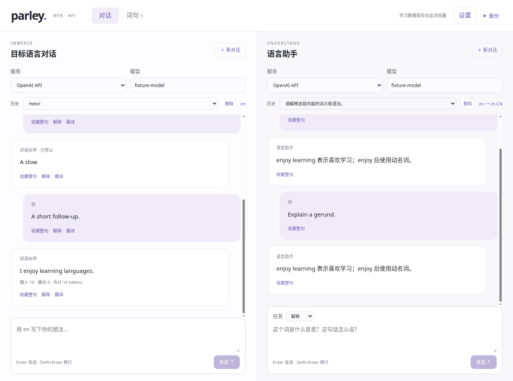
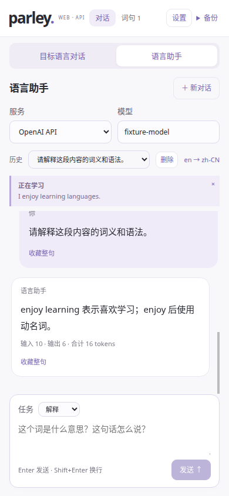

# Parley Web

[在线使用 Parley Web](https://krahsu.github.io/parley/)。Web 端只支持 API，可作为静态站点部署到 GitHub Pages。桌面端继续提供 Rust / Diesel 存储和本机 Codex、Claude Code；Web 使用独立浏览器入口，不加载 Tauri IPC，也不要求安装 CLI、Node 或桌面应用。

## 使用

1. 打开站点，进入设置，填写母语与目标语言，添加服务地址和自己的 API Key。
2. 为主聊和语言助手分别选择服务、填写模型 ID。可以读取模型列表；服务没有开放该接口时直接填写 ID。
3. 用目标语言对话。选中消息中的文字后收藏或解释；助手也接受母语提问、翻译和表达练习。
4. 在词句页补充释义、注释、标签，查看原句来源并加入识义复习。

支持的协议及预设：OpenAI Responses、Claude Messages、Gemini Interactions；DeepSeek、千问、Kimi、Z.AI 及自定义 Chat Completions 兼容服务。浏览器直接向用户填写的地址发送请求，保留协议各自的续聊内容；流式失败不伪装为完成，停止只影响当前面板。切换服务或已使用会话的模型时创建独立会话，原历史继续保留。语言设置变更用于新对话及尚未发送消息的对话。

按用户要求，本阶段暂缓真实 API 厂商实测。已有协议 fixture 和浏览器回环 HTTP/SSE 验证；不能据此认定所有服务的 CORS、账号权限或模型可用性都已验证。Gemini Interactions 与桌面端采用相同的 `2026-05-20` API revision。

## 浏览器与数据边界

- API Key 仅保留在当前标签页内存，刷新或关闭后需重新填写。站点构建不使用 API secrets，密钥不上传 GitHub、不写入 IndexedDB、不进入备份。请求仅带给用户配置的服务；禁止带凭据重定向到其他地址。
- GitHub Pages 没有 API 转发服务器。目标服务必须允许浏览器跨域请求（CORS）；不允许时使用自己管理且允许该站点来源的网关，或改用桌面端。页面不会自动把密钥发给公共代理。Claude 请求显式启用其浏览器访问头，与官方 SDK 的 browser opt-in 对应。[官方 SDK](https://github.com/anthropics/anthropic-sdk-typescript#requirements)
- 历史、草稿、配置、词句与复习进度保存在当前浏览器的 IndexedDB。清理站点数据、隐私窗口退出或换浏览器会影响这些数据；使用备份迁移。没有账号登录或跨设备同步。
- 支持 Web Locks 的浏览器只允许一个标签页编辑同一工作区；其他页显示只读。写入还通过 IndexedDB 事务核对版本，避免旧页面覆盖新数据。保存失败会停止继续发送 API 请求，并提供导出入口。
- Web 新备份使用独立的 `parley-web` 逐行格式（format 2），并保留旧 v1 JSON 导入，包含可见聊天和学习数据；不包含密钥、隐藏推理与协议私有续聊对象。导入前显示数量并确认替换当前数据。桌面 JSON v1/v2 备份暂不直接互通，不会静默误解析。
- 复习为独立的识义卡片，记住后按 1/3/7/14/30/60 天递进，再学一次安排到 10 分钟后。词句原句快照随备份保存。页面打开后可在无 API 凭据时操作本地词句；未实现离线缓存整个网站。
- 适用于支持 IndexedDB、Fetch 流、AbortController、TextDecoder 和现代 JavaScript 的浏览器。手机使用两个切换面板；组合输入回车不发送，Shift+Enter 换行。

## 开发与部署

```bash
npm ci
npm run web:dev
npm run web:build
npm run web:preview
```

`web:dev` 使用 Vite 的 web mode；生产文件位于 `dist-web/`。桌面入口和原有 `npm run build` 保持独立。Web 默认使用相对资源路径，支持 `https://OWNER.github.io/REPO/` 子目录；如有需要，构建时用 `PARLEY_WEB_BASE` 指定路径。

`.github/workflows/pages.yml` 对 PR 检查格式、前端测试与 Web 构建；只有 `main` 的 push 或手动运行可以部署。仓库 Pages 使用 GitHub Actions 发布源，部署环境为 `github-pages`。工作流和部署环境均只允许 `main` 发布。工作流不需要任何 API Key。[GitHub Pages 官方工作流说明](https://docs.github.com/en/pages/getting-started-with-github-pages/using-custom-workflows-with-github-pages)

Web 静态部署和桌面发行包分开发布。发布 Web 站点不会安装或更新用户本机 Parley。

## 本次验收（2026-09-14）

前端共 79 项测试通过，其中 Web 新增 17 项，覆盖四种 API 协议、复用桌面厂商 fixture、UTF-8 / CRLF 分片、上下文预算、原生续聊字段、错误终态、两侧取消隔离、保存失败前阻止付费请求、来源快照及无密钥备份。桌面前端生产构建和独立 Web 构建均通过。Web 构建额外检查独立入口、相对资源路径和不含 Tauri IPC。

在独立 Chrome 配置中使用真实静态文件、`/parley/` 子目录和另一个端口的 CORS HTTP/SSE fixture，验证：API 配置及模型读取、对话与助手解释、词句和中文释义保存、主聊中断而助手完成、刷新历史及中文草稿恢复、刷新后会话密钥消失、词句复习评分、JSON 导出及确认导入、390px 手机布局，以及第二个标签页只读。检查 IndexedDB 与备份均不含合成 API Key；浏览器未出现未捕获异常。此验证没有真实厂商请求。





## 保存与恢复

Web 现按消息、会话和词条分别保存到 IndexedDB v2，旧数据在首次打开时通过事务迁移。保存词句成功后才关闭编辑窗口；恢复备份失败时，当前数据和导入预览保留。旧数据若包含超过 100 字符的单个标签，可在错误页先导出原始数据，再选择“修复过长标签”。

新导出为 `.jsonl` 逐行备份，旧 `.json` 继续支持导入。导入与导出采用相同的字段和记录数量约束，不再出现可导出但被 32 MiB 限制拒绝导入的情况。备份没有 API Key 或服务商私有续聊对象。词句列表每页 50 条，搜索覆盖全部词条。

浏览器流程回归：`npm run test:web`。初次运行先执行 `npx playwright install chromium`；测试只访问本地静态文件与 HTTP/SSE fixture，不消耗模型额度，也不将测试内容部署到网站。
